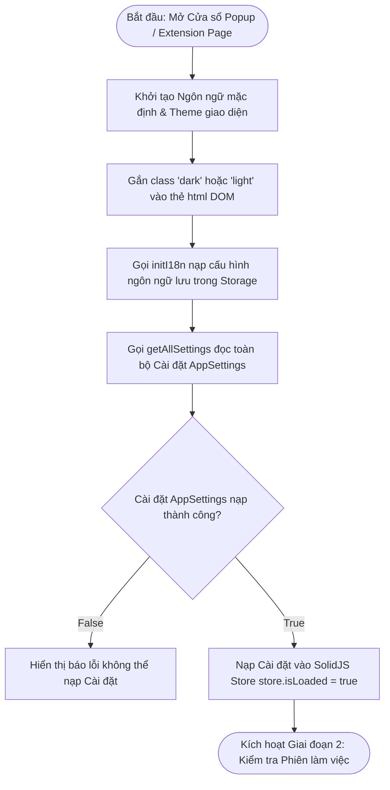
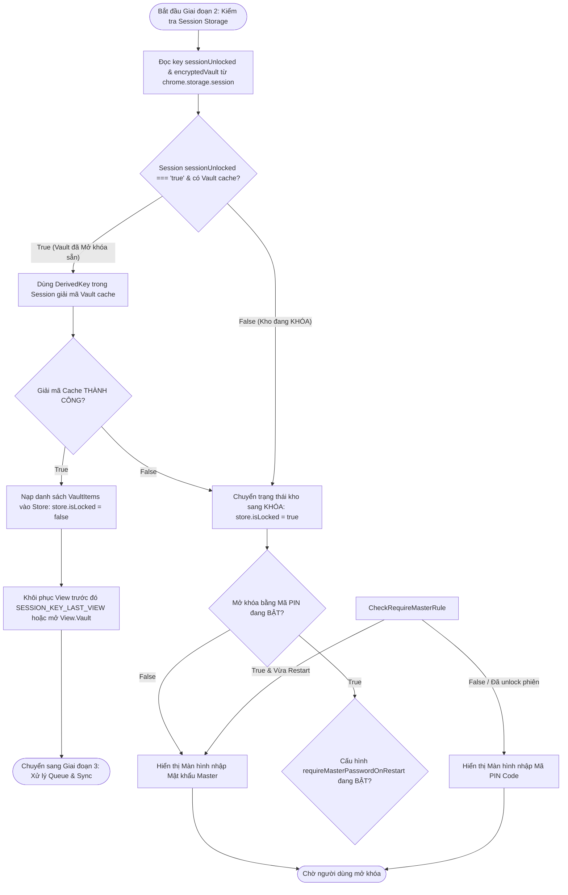
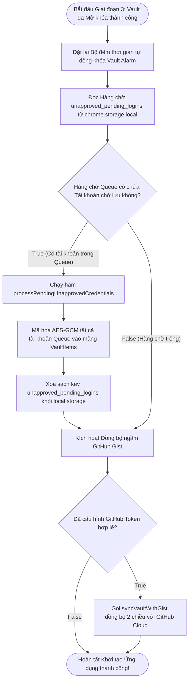

# Tài Liệu Mô Tả Chi Tiết: Luồng Khởi Tạo Ứng Dụng & Vòng Đời Boot (App Initialization & Boot Lifecycle)

Tài liệu này mô tả chi tiết kiến trúc, thứ tự ưu tiên nạp module và luồng thuật
toán rẽ nhánh **True / False** của **Luồng Khởi Tạo Ứng Dụng (App
Initialization)** trong Gistwarden từ lúc mở Popup / Extension cho tới khi hoàn
tất nạp kho dữ liệu.

---

## 1. Tổng Quan (Overview)

Luồng khởi tạo của Gistwarden đóng vai trò cốt lõi trong việc đảm bảo tính bảo
mật và trải nghiệm tức thì cho người dùng:

- **Tốc độ nạp tức thì (Instant Startup)**: Ngôn ngữ mặc định và Giao diện
  (Theme) được thiết lập đồng bộ ngay tại bước nạp module để chống giật/nháy
  giao diện.
- **Xác thực phiên an toàn (Session Management)**: Kiểm tra thông minh trạng
  thái khóa trong `chrome.storage.session` để quyết định mở thẳng Vault hay yêu
  cầu mở khóa bằng Master Password / Mã PIN.
- **Tự động xử lý Hàng chờ (Auto Queue Drain)**: Tự động gom và mã hóa các tài
  khoản được yêu cầu lưu trước đó khi Vault bị khóa ngay khi ứng dụng boot thành
  công.

---

## 🛑 GIAI ĐOẠN 1: Nạp Module & Khởi Tạo Môi Trường (Module Boot & Environment Phase)

Giai đoạn này diễn ra ngay khi mở Popup (`src/popup-entry.tsx`) hoặc trang Hướng
dẫn (`src/guide-entry.tsx`).

---

## 🔓 GIAI ĐOẠN 2: Kiểm Tra Trạng Thái Phiên & Mở Khóa Vault (Session & Lock Check Phase)

Giai đoạn này xác định xem kho lưu trữ Vault đã được giải mã sẵn trong Session
hay cần mở khóa.

---

## ⚙️ GIAI ĐOẠN 3: Đặt Giờ Timeout, Xử Lý Queue & Đồng Bộ Gist (Post-Boot & Background Sync Phase)

Giai đoạn này diễn ra ngay sau khi kho Vault được mở khóa thành công.

---

## 📊 TÓM TẮT QUY TRÌNH RẼ NHÁNH TỔNG HỢP (Decision Matrix)

| Bước    | Câu hỏi điều kiện                                        | Kết quả TRUE                                    | Kết quả FALSE                                 |
| :------ | :------------------------------------------------------- | :---------------------------------------------- | :-------------------------------------------- |
| **1.1** | Cài đặt `AppSettings` nạp thành công từ Storage?         | Nạp Cài đặt vào Store, chuyển sang Giai đoạn 2  | Báo lỗi không thể nạp Cài đặt                 |
| **2.1** | `sessionUnlocked === "true"` & có Vault Cache?           | Giải mã Vault cache & Nạp thẳng kho dữ liệu     | Đặt `store.isLocked = true` (Chuyển sang 2.2) |
| **2.2** | Cấu hình Mở khóa bằng PIN (`pinUnlockEnabled`) BẬT?      | Kiểm tra quy định khi khởi động lại trình duyệt | Hiển thị màn hình nhập Mật khẩu Master        |
| **3.1** | Hàng chờ Queue `unapproved_pending_logins` có tài khoản? | Tự động lưu Batch vào Vault & Xóa Queue         | Chuyển sang bước kiểm tra Đồng bộ Gist        |
| **3.2** | Đã cấu hình GitHub Token hợp lệ?                         | Tự động chạy `syncVaultWithGist` đồng bộ Gist   | Hoàn tất khởi tạo, ứng dụng sẵn sàng          |

---

## 📁 Danh Sách File Mã Nguồn Liên Quan

1. **[`src/popup-entry.tsx`](file:///c:/Users/kien.hm/Desktop/totp%20generate/src/popup-entry.tsx)**:
   File khởi tạo chính của Cửa sổ Popup Extension.
2. **[`src/guide-entry.tsx`](file:///c:/Users/kien.hm/Desktop/totp%20generate/src/guide-entry.tsx)**:
   File khởi tạo của Trang Hướng dẫn & Cài đặt mở rộng.
3. **[`src/core/store.ts`](file:///c:/Users/kien.hm/Desktop/totp%20generate/src/core/store.ts)**:
   Quản lý trạng thái toàn cục SolidJS Store (`store.isLocked`,
   `store.isLoaded`, `store.vaultItems`...).
4. **[`src/core/i18n.ts`](file:///c:/Users/kien.hm/Desktop/totp%20generate/src/core/i18n.ts)**:
   Nạp cấu hình ngôn ngữ từ Storage qua `initI18n()`.
5. **[`src/features/auth/session-service.ts`](file:///c:/Users/kien.hm/Desktop/totp%20generate/src/features/auth/session-service.ts)**:
   Quản lý chìa khóa và Vault cache trong `chrome.storage.session`.
6. **[`src/extension/background.ts`](file:///c:/Users/kien.hm/Desktop/totp%20generate/src/extension/background.ts)**:
   Lắng nghe sự kiện khởi động trình duyệt (`onStartup`/`onInstalled`) và tự
   động giải phóng Hàng chờ `processPendingUnapprovedCredentials`.
