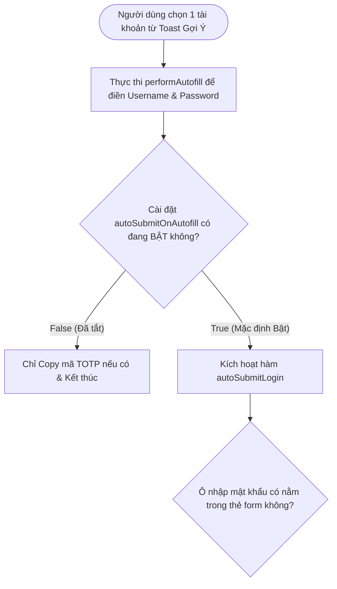
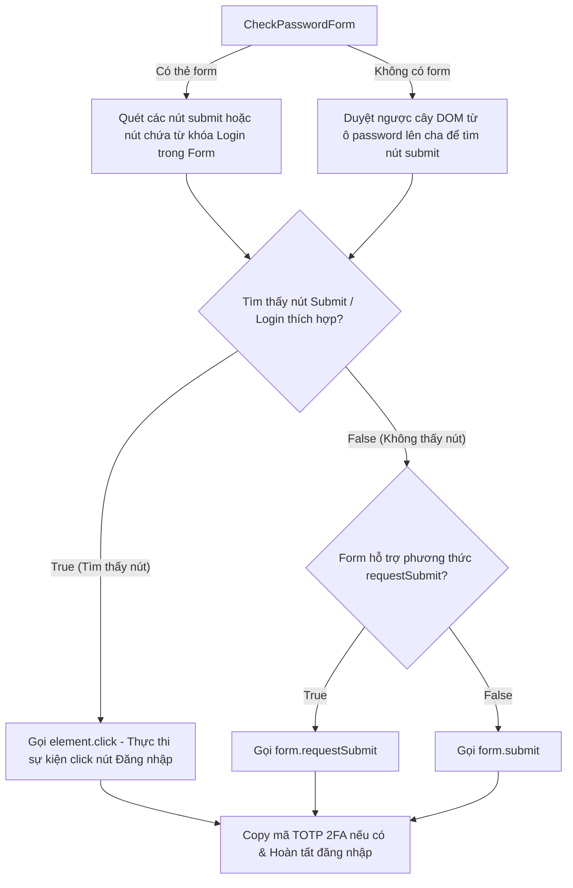

# Tài Liệu Mô Tả Chi Tiết: Chức Năng Tự Động Đăng Nhập Sau Khi Điền (Auto-Submit Login)

Tài liệu này mô tả chi tiết kiến trúc, quy trình xử lý và luồng thuật toán của
tính năng **Tự Động Đăng Nhập Sau Khi Tự Điền (Auto-Submit Login)** khi người
dùng chọn tài khoản từ thông báo Toast gợi ý (Autofill Suggestion Toast).

---

## 1. Nguyên Tắc Hoạt Động (Design Directives)

1. **Chiến Lược Click Nút Ưu Tiên (Bitwarden Button-First Strategy)**:
   - Thay vì chỉ gọi `form.submit()`, hệ thống ưu tiên quét tìm các nút bấm
     Submit (`button[type="submit"]`, `input[type="submit"]`) hoặc các nút bấm
     có từ khóa Đăng nhập (`login`, `sign in`, `đăng nhập`, `submit`...) để kích
     hoạt phương thức `element.click()`.
   - Giúp đảm bảo tương thích tốt với các ứng dụng Single Page App (React, Vue,
     Angular) lắng nghe sự kiện `click` thay vì `submit`.

2. **Dự Phòng Submit Form Chuẩn (Form requestSubmit Fallback)**:
   - Nếu không tìm thấy nút bấm Submit phù hợp, hệ thống chuyển sang gọi
     `form.requestSubmit()` (hoặc `form.submit()` với các trình duyệt cũ) để
     thực thi submit form HTML5 chuẩn.

3. **Hỗ Trợ Trang Đăng Nhập Không Dùng Thẻ Form (Formless Fields Support)**:
   - Đối với các trang web không bọc ô nhập mật khẩu trong thẻ `<form>`, hệ
     thống tiến hành duyệt ngược cây DOM từ ô nhập mật khẩu lên các phần tử cha
     (kể cả xuyên qua `ShadowRoot`) để lội tìm nút Submit gần nhất.

4. **Tùy Chọn Bật/Tắt Cài Đặt (User Preference Setting)**:
   - Cung cấp tùy chọn `autoSubmitOnAutofill` trong trang Cài đặt (mặc định
     **Bật / `true`**).
   - Chỉ khi tùy chọn này đang bật, thao tác chọn tài khoản trên Toast gợi ý mới
     thực thi Auto-Submit.

---

## 🛑 GIAI ĐOẠN 1: Bắt Sự Kiện Chọn Tài Khoản & Kiểm Tra Cài Đặt Auto-Submit

---

## 🔓 GIAI ĐOẠN 2: Dò Tìm Nút Bấm & Submit Form (Auto-Submit Execution)

---

## 📊 TÓM TẮT QUY TRÌNH XỬ LÝ ĐIỀU KIỆN TỔNG HỢP (Decision Matrix)

| Bước    | Câu hỏi điều kiện                                        | Kết quả TRUE                                    | Kết quả FALSE                                     |
| :------ | :------------------------------------------------------- | :---------------------------------------------- | :------------------------------------------------ |
| **1.1** | Người dùng bấm nút chọn tài khoản trên Toast?            | Thực hiện điền dữ liệu & kiểm tra Cài đặt (1.2) | Toast hết thời gian đếm ngược hoặc bị đóng        |
| **1.2** | Cài đặt `autoSubmitOnAutofill` đang được bật?            | Thực thi `autoSubmitLogin()` (2.1)              | Chỉ điền dữ liệu + Copy TOTP (Không tự đăng nhập) |
| **2.1** | Tìm thấy nút Submit hoặc nút bấm chứa từ khóa Đăng nhập? | Gọi `button.click()` trực tiếp trên DOM         | Chuyển sang kiểm tra `requestSubmit()` (2.2)      |
| **2.2** | Form hỗ trợ phương thức HTML5 `form.requestSubmit()`?    | Gọi `form.requestSubmit()`                      | Trực tiếp gọi `form.submit()`                     |

---

## 📁 Danh Sách File Mã Nguồn Cần Cập Nhật

1. **[`src/core/storage.ts`](file:///c:/Users/kien.hm/Desktop/totp%20generate/src/core/storage.ts)**:
   Thêm `autoSubmitOnAutofill: z.boolean().default(true)` vào `SettingsSchema`.
2. **[`src/core/store.ts`](file:///c:/Users/kien.hm/Desktop/totp%20generate/src/core/store.ts)**:
   Thêm thuộc tính `autoSubmitOnAutofill` vào trạng thái reactive store.
3. **[`src/features/settings/AutofillOptions.tsx`](file:///c:/Users/kien.hm/Desktop/totp%20generate/src/features/settings/AutofillOptions.tsx)**:
   Trang Cài đặt mới cho phép bật/tắt Auto-submit.
4. **[`src/extension/autofill-core.ts`](file:///c:/Users/kien.hm/Desktop/totp%20generate/src/extension/autofill-core.ts)**:
   Bổ sung hàm `autoSubmitLogin` quét nút bấm và submit form theo phong cách
   Bitwarden.
5. **[`src/extension/autofill-content-script.ts`](file:///c:/Users/kien.hm/Desktop/totp%20generate/src/extension/autofill-content-script.ts)**:
   Truyền cấu hình `autoSubmitOnAutofill` vào `performAutofill` khi người dùng
   chọn tài khoản.
