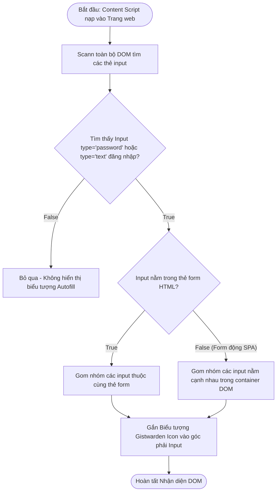
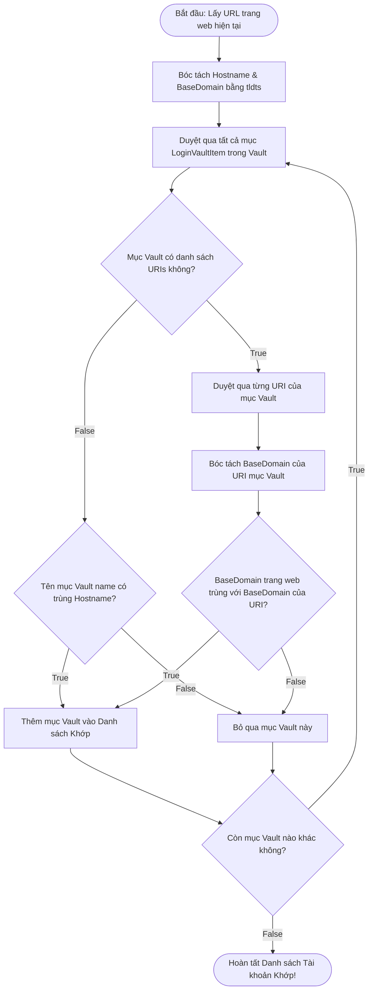

# Tài Liệu Mô Tả Chi Tiết: Chức Năng Tự Động Điền & Thuật Toán Khớp Tên Miền (Autofill & Domain Matching Engine)

Tài liệu này mô tả chi tiết kiến trúc, thuật toán phân tích DOM và luồng xử lý
điều kiện của công cụ **Tự động Điền (Autofill)** và **Khớp Tên Miền (Domain
Matching)** trong Gistwarden.

---

## 1. Tổng Quan (Overview)

Chức năng **Autofill** của Gistwarden tự động nhận diện các trường nhập liệu
(Username, Password, TOTP) trên trang web và điền thông tin đăng nhập từ Vault:

- **Thuật toán Khớp Tên miền (Domain Matching Engine)**: Sử dụng thư viện
  `tldts` để bóc tách Tên miền Gốc (Base Domain / Public Suffix List), đảm bảo
  khớp chính xác giữa các subdomain (ví dụ `login.example.com` và
  `app.example.com`).
- **Phân tích DOM linh hoạt**: Hỗ trợ form HTML chuẩn `<form>`, form động không
  thẻ `<form>` (chỉ có các thẻ `<input>`), form phân đoạn 2 bước (Username
  trước, Password sau).

---

## 🛑 GIAI ĐOẠN 1: Phát Hiện Trường Nhập Liệu trên Trang Web (DOM Field Detection Phase)



---

## 🔍 GIAI ĐOẠN 2: Thuật Toán Khớp Tên Miền (Domain Matching Algorithm Phase)

Giai đoạn này đối chiếu URL trang web hiện tại với URI lưu trữ trong Vault
(`vault-domain-matching.ts`).



---

## ⚡ GIAI ĐOẠN 3: Thực Hiện Điền Tự Động (Autofill Execution Phase)

```mermaid
flowchart TD
    FillStart([Bắt đầu: Người dùng click Icon Gistwarden hoặc chọn Tài khoản]) --> CheckMatchingCount{Số lượng Tài khoản Khớp tìm thấy?}
    
    CheckMatchingCount -- 0 Tài khoản --> ShowNoAccountPopup[Hiển thị Popup: Không tìm thấy tài khoản phù hợp]
    CheckMatchingCount -- 1 Tài khoản Khớp --> AutoSelectAccount[Tự động chọn Tài khoản duy nhất đó]
    CheckMatchingCount -- Nhiều Tài khoản Khớp --> ShowAccountSelector[Hiển thị Menu Dropdown chọn Tài khoản]
    
    ShowAccountSelector --> UserSelectsAccount[Người dùng click chọn 1 Tài khoản]
    UserSelectsAccount --> AutoSelectAccount
    
    AutoSelectAccount --> FillFields[Điền Username vào input.username & Password vào input.password]
    FillFields --> DispatchInputEvents[Bắn các sự kiện input, change, keydown mô phỏng người dùng gõ phím]
    
    DispatchInputEvents --> CheckTotpSecret{Tài khoản có chứa TOTP Secret (2FA)?}
    CheckTotpSecret -- True --> CalculateTotpCode[Tính mã OTP 6 chữ số theo thời gian thực]
    CalculateTotpCode --> CopyTotpToClipboard[Tự động Copy mã TOTP vào Clipboard người dùng & Báo Toast]
    CheckTotpSecret -- False --> FillComplete
    
    CopyTotpToClipboard --> FillComplete([Hoàn tất Autofill thành công!])
```

---

## 📊 TÓM TẮT QUY TRÌNH XỬ LÝ ĐIỀU KIỆN TỔNG HỢP (Decision Matrix)

| Bước    | Câu hỏi điều kiện                                  | Kết quả TRUE                             | Kết quả FALSE                        |
| :------ | :------------------------------------------------- | :--------------------------------------- | :----------------------------------- |
| **1.1** | Tìm thấy input `password` hoặc `text` đăng nhập?   | Gom nhóm & Gắn Icon Gistwarden           | Bỏ qua không xử lý                   |
| **1.2** | Input nằm trong thẻ `<form>` HTML chuẩn?           | Gom nhóm theo thẻ `<form>`               | Gom nhóm theo container DOM gần nhất |
| **2.1** | BaseDomain của trang web trùng với BaseDomain URI? | Thêm vào Danh sách Tài khoản Khớp        | Bỏ qua mục Vault này                 |
| **3.1** | Tìm thấy duy nhất 1 Tài khoản khớp?                | Tự động chọn tài khoản đó                | Hiển thị Menu Dropdown lựa chọn      |
| **3.2** | Tài khoản có chứa cấu hình TOTP (2FA)?             | Tính mã OTP & Tự động Copy vào Clipboard | Hoàn thành điền thông tin            |

---

## 📁 Danh Sách File Mã Nguồn Liên Quan

1. **[`src/extension/autofill-core.ts`](file:///c:/Users/kien.hm/Desktop/totp%20generate/src/extension/autofill-core.ts)**:
   Nhận diện trường DOM input, phân tích form và điền giá trị.
2. **[`src/extension/autofill-content-script.ts`](file:///c:/Users/kien.hm/Desktop/totp%20generate/src/extension/autofill-content-script.ts)**:
   Content script lắng nghe sự kiện IPC từ Background.
3. **[`src/features/vault/vault-domain-matching.ts`](file:///c:/Users/kien.hm/Desktop/totp%20generate/src/features/vault/vault-domain-matching.ts)**:
   Thuật toán khớp tên miền (`findMatchingVaultItems`).
4. **[`src/core/domain-utils.ts`](file:///c:/Users/kien.hm/Desktop/totp%20generate/src/core/domain-utils.ts)**:
   Hàm bóc tách BaseDomain bằng thư viện `tldts` (`getBaseDomain`,
   `getHostname`).
