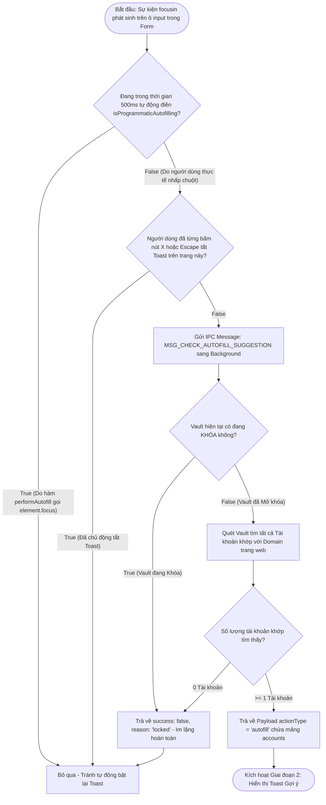
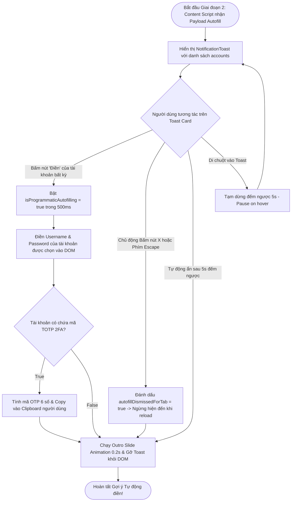

# Tài Liệu Mô Tả Chi Tiết: Chức Năng Gợi Ý Tự Động Điền Qua Toast (Autofill Suggestion Toast)

Tài liệu này mô tả chi tiết kiến trúc, quy trình xử lý và luồng thuật toán rẽ
nhánh **True / False** của tính năng **Gợi ý Tự động Điền qua Toast Notification
(Autofill Suggestion Toast)** khi người dùng nhấp/focus vào ô nhập mật khẩu trên
trang web.

---

## 1. Nguyên Tắc Hoạt Động (Design Directives)

1. **Trạng Thái Im Lặng Khi Vault Bị Khóa (Silent When Locked)**:
   - Nếu kho Vault đang **KHÓA**, hệ thống sẽ **im lặng hoàn toàn** (không hiển
     thị Toast) khi người dùng nhấp vào ô nhập mật khẩu để tránh gây phiền hà.
2. **Cho Phép Chọn & Đổi Tài Khoản Linh Hoạt (Flexible Account Switcher)**:
   - Khi người dùng bấm **[ Điền ]** một tài khoản, form sẽ được điền dữ liệu và
     Toast đóng lại.
   - Nếu sau đó người dùng **nhấp lại vào ô input** (vì muốn đổi sang tài khoản
     khác), Toast sẽ **xuất hiện trở lại** cho phép chọn tài khoản mới dễ dàng.
3. **Chống Tự Động Trigger Do Sự Kiện Lập Trình (500ms Programmatic Focus
   Suppression)**:
   - Khi thực hiện điền dữ liệu, hàm `performAutofill()` tự động gọi
     `element.focus()` của DOM làm phát sinh sự kiện `focusin` giả lập lập
     trình.
   - Hệ thống bật cờ tạm thời `isProgrammaticAutofilling = true` trong 500ms để
     **chặn sự kiện `focusin` giả lập**, nhưng **cho phép sự kiện click/focus
     thực tế của người dùng sau đó tiếp tục kích hoạt Toast**.
4. **Cơ Chế Tắt Vĩnh Viễn Theo Trang Khi Bấm Nút [×] Hoặc [Escape] (Explicit
   Dismissal)**:
   - Chỉ khi người dùng **chủ động bấm nút [ × ]** trên Toast hoặc bấm phím **[
     Escape ]**:
     - Hệ thống mới ghi nhận `autofillDismissedForTab = true`.
     - Toast sẽ **ngừng hiển thị hoàn toàn** cho tới khi người dùng tải lại
       trang (Page Reload).
5. **Hiển Thị Danh Sách Tất Cả Tài Khoản Khớp (Multi-Account List View)**:
   - Nếu tìm thấy 1 tài khoản: Hiển thị tên tài khoản + Nút **[ Điền ngay ]**.
   - Nếu tìm thấy nhiều tài khoản ($\ge 2$): Hiển thị **danh sách tất cả các tài
     khoản trực tiếp** kèm nút **[ Điền ]** riêng cho từng tài khoản.

---

## 🛑 GIAI ĐOẠN 1: Bắt Sự Kiện Focus & Kiểm Tra Trạng Thái Vault

---

## 🔓 GIAI ĐOẠN 2: Hiển Thị Toast & Thao Tác Điền Tự Động (Toast & Autofill Phase)

---

## 📊 TÓM TẮT QUY TRÌNH RẼ NHÁNH TỔNG HỢP (Decision Matrix)

| Bước    | Câu hỏi điều kiện                                            | Kết quả TRUE                                  | Kết quả FALSE                                     |
| :------ | :----------------------------------------------------------- | :-------------------------------------------- | :------------------------------------------------ |
| **1.1** | Sự kiện focus do hàm `performAutofill()` phát ra?            | Bỏ qua (Chặn trong 500ms)                     | Kiểm tra cờ `autofillDismissedForTab` (1.2)       |
| **1.2** | Người dùng đã từng bấm nút `×` hoặc `Escape` trên trang này? | Bỏ qua (Tắt hoàn toàn cho tới khi reload)     | Gửi `MSG_CHECK_AUTOFILL_SUGGESTION`               |
| **1.3** | Kho dữ liệu Vault hiện tại đang KHÓA (Locked)?               | Trả về `reason: "locked"` (Im lặng hoàn toàn) | Kiểm tra tài khoản khớp Domain (1.4)              |
| **1.4** | Tìm thấy $\ge$ 1 tài khoản khớp với Domain?                  | Trả về Payload chứa mảng tất cả `accounts`    | Im lặng hoàn toàn (Không hiện gợi ý)              |
| **2.1** | Người dùng bấm nút **[ Điền ]** của 1 tài khoản?             | Bật 500ms Suppress, Điền Form & Copy TOTP     | Hết 5s/Bấm X $\rightarrow$ Đóng Toast mượt mà     |
| **2.2** | Người dùng chủ động bấm nút `×` hoặc phím `Escape`?          | Gán `autofillDismissedForTab = true`          | Đóng Toast nhưng cho phép xuất hiện lại khi focus |

---

## 📁 Danh Sách File Mã Nguồn Cần Cập Nhật

1. **[`src/features/notification/NotificationToast.tsx`](file:///c:/Users/kien.hm/Desktop/totp%20generate/src/features/notification/NotificationToast.tsx)**:
   Xử lý callback `onFill` và `onDismiss`.
2. **[`src/extension/autofill-content-script.ts`](file:///c:/Users/kien.hm/Desktop/totp%20generate/src/extension/autofill-content-script.ts)**:
   Thêm cờ `isProgrammaticAutofilling` với `setTimeout 500ms` khi điền dữ liệu.
   Chỉ khi nhấp nút `×` hoặc phím `Escape` mới gán
   `autofillDismissedForTab = true`. Khi người dùng tự nhấp chuột lại vào ô
   input sau 500ms, Toast sẽ tự động hiển thị trở lại để đổi tài khoản.
