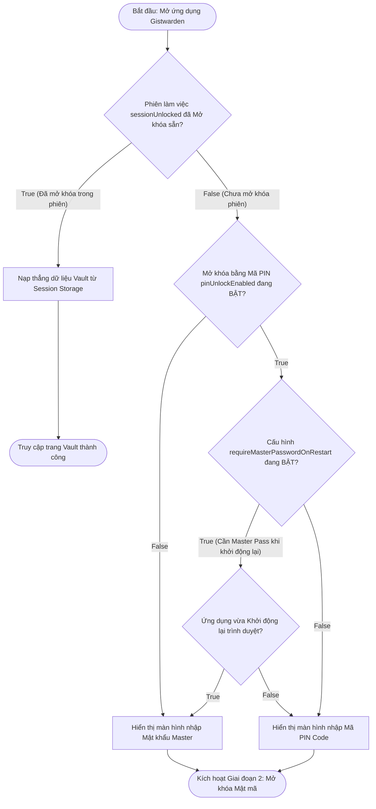
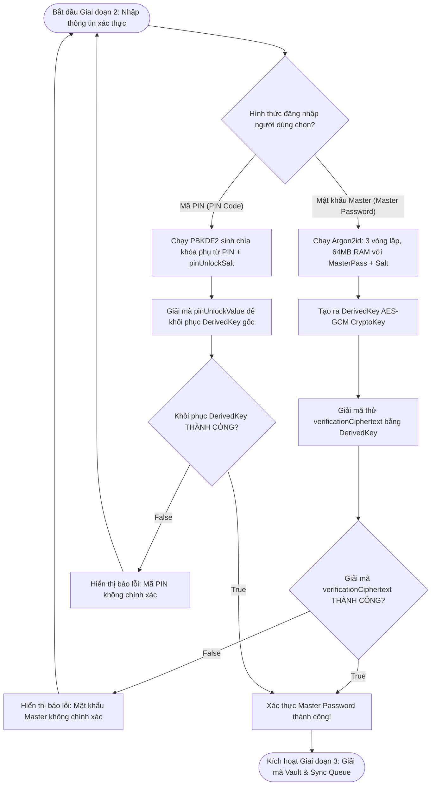
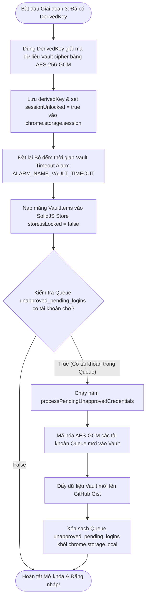

# Tài Liệu Mô Tả Chi Tiết: Chức Năng Đăng Nhập & Mở Khóa Vault (Login & Auth Flow)

Tài liệu này mô tả chi tiết kiến trúc, quy trình xử lý mật mã (Cryptography) và
luồng thuật toán rẽ nhánh **True / False** của tính năng **Đăng nhập & Mở khóa
Vault** trong Gistwarden bằng Mật khẩu Master (Master Password) hoặc Mã PIN (PIN
Unlock).

---

## 1. Tổng Quan (Overview)

Mô hình bảo mật của Gistwarden tuân thủ nghiêm ngặt nguyên tắc **Zero-Knowledge
Architecture**:

- Mật khẩu Master của người dùng **không bao giờ được lưu trữ** dưới dạng thô
  hay gửi đi bất kỳ đâu.
- Chìa khóa giải mã chính (`DerivedKey`) được dẫn xuất trực tiếp từ Master
  Password bằng thuật toán chống tấn công brute-force hiện đại nhất **Argon2id
  (hash-wasm: 3 vòng lặp, 64MB bộ nhớ)** kết hợp với Muối ngẫu nhiên (`Salt`).
- Dữ liệu Vault được mã hóa đối xứng **AES-256-GCM** hoàn toàn tại máy người
  dùng trước khi lưu vào Storage hoặc đồng bộ GitHub Gist.

---

## 🛑 GIAI ĐOẠN 1: Kiểm Tra Trạng Thái Phiên Làm Việc (Session & Timeout Check Phase)

Khi mở ứng dụng (Popup / Popout / Extension Page), hệ thống sẽ xác định hình
thức mở khóa phù hợp.

---

## 🔓 GIAI ĐOẠN 2: Xác Thực Mật Mã & Giải Mã Khóa Chính (Cryptography Unlock Phase)

Giai đoạn này xác thực Master Password hoặc Mã PIN để khôi phục chìa khóa mã hóa
chính `DerivedKey` (CryptoKey).

---

## ⚙️ GIAI ĐOẠN 3: Giải Mã Vault, Hẹn Giờ Timeout & Xử Lý Queue (Vault Boot Phase)

Giai đoạn này giải xem toàn bộ danh sách VaultItems, kích hoạt bộ đếm tự động
khóa và tự động lưu các tài khoản đang chờ trong Queue.

---

## 📊 TÓM TẮT QUY TRÌNH RẼ NHÁNH TỔNG HỢP (Decision Matrix)

| Bước    | Câu hỏi điều kiện                                              | Kết quả TRUE                                              | Kết quả FALSE                            |
| :------ | :------------------------------------------------------------- | :-------------------------------------------------------- | :--------------------------------------- |
| **1.1** | Phiên làm việc `sessionUnlocked` đã Mở khóa sẵn?               | Nạp thẳng dữ liệu Vault không cần mật khẩu                | Kiểm tra hình thức mở khóa (1.2)         |
| **1.2** | Cấu hình Mở khóa bằng PIN (`pinUnlockEnabled`) BẬT?            | Kiểm tra yêu cầu Master Pass khi restart (1.3)            | Hiển thị màn hình nhập Mật khẩu Master   |
| **1.3** | Cần Master Pass khi Khởi động lại trình duyệt?                 | Nếu vừa restart $\rightarrow$ Nhập Master Password        | Hiển thị màn hình nhập Mã PIN Code       |
| **2.1** | Giải mã `verificationCiphertext` bằng Argon2id Key thành công? | Xác thực Master Password đúng $\rightarrow$ Nạp Vault     | Báo lỗi: Mật khẩu Master không chính xác |
| **2.2** | Giải mã `pinUnlockValue` bằng PIN thành công?                  | Xác thực Mã PIN đúng $\rightarrow$ Khôi phục `DerivedKey` | Báo lỗi: Mã PIN không chính xác          |
| **3.1** | Hàng chờ Queue `unapproved_pending_logins` có tài khoản?       | Tự động lưu Batch vào Vault & Upload Gist                 | Đăng nhập thành công, sẵn sàng sử dụng   |

---

## 📁 Danh Sách File Mã Nguồn Liên Quan

1. **[`src/core/crypto.ts`](file:///c:/Users/kien.hm/Desktop/totp%20generate/src/core/crypto.ts)**:
   Hàm `deriveKey` sử dụng thuật toán **Argon2id (`hash-wasm`) với 3 vòng lặp
   (iterations) và 64MB RAM (`ARGON2_MEMORY = 65536`)**, cùng các hàm mã
   hóa/giải mã AES-GCM-256 (`encryptData`, `decryptData`).
2. **[`src/features/auth/master-password-service.ts`](file:///c:/Users/kien.hm/Desktop/totp%20generate/src/features/auth/master-password-service.ts)**:
   Quản lý khởi tạo Master Password, tạo `verificationCiphertext` xác thực.
3. **[`src/features/auth/pin-service.ts`](file:///c:/Users/kien.hm/Desktop/totp%20generate/src/features/auth/pin-service.ts)**:
   Mã hóa/Giải mã chìa khóa chính `DerivedKey` bằng Mã PIN (`setupPinUnlock`,
   `unlockWithPin`).
4. **[`src/features/auth/auth-service.ts`](file:///c:/Users/kien.hm/Desktop/totp%20generate/src/features/auth/auth-service.ts)**:
   Điều phối quá trình Đăng nhập (`login`), Mở khóa (`unlock`), Khóa kho
   (`lock`) và Đăng xuất (`logout`).
5. **[`src/features/auth/session-service.ts`](file:///c:/Users/kien.hm/Desktop/totp%20generate/src/features/auth/session-service.ts)**:
   Quản lý bộ đếm Vault Timeout Alarm (`ALARM_NAME_VAULT_TIMEOUT`) và lưu trữ
   Session Storage.
6. **[`src/features/auth/components/MasterPasswordForm.tsx`](file:///c:/Users/kien.hm/Desktop/totp%20generate/src/features/auth/components/MasterPasswordForm.tsx)**:
   Component giao diện biểu mẫu nhập Master Password / PIN.
7. **[`src/extension/background.ts`](file:///c:/Users/kien.hm/Desktop/totp%20generate/src/extension/background.ts)**:
   Tự động xử lý Hàng chờ `processPendingUnapprovedCredentials` ngay khi mở khóa
   Vault.
