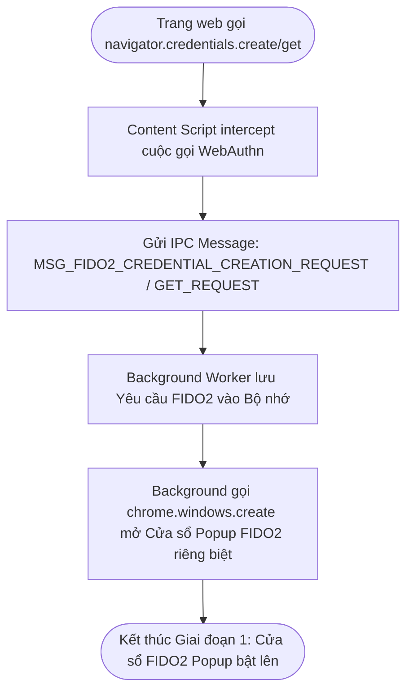
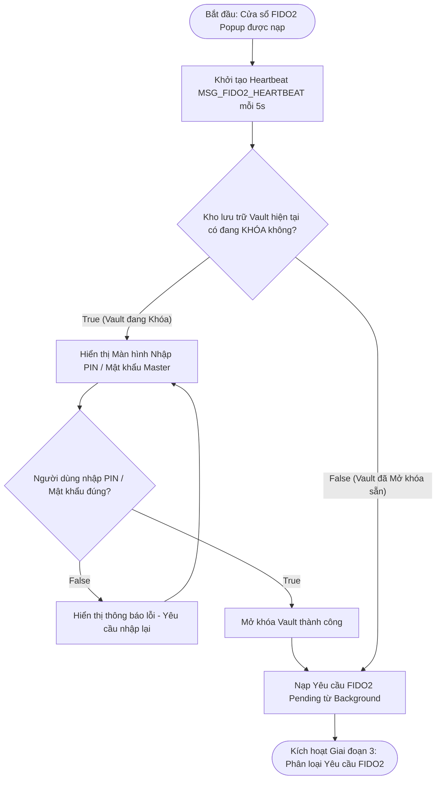
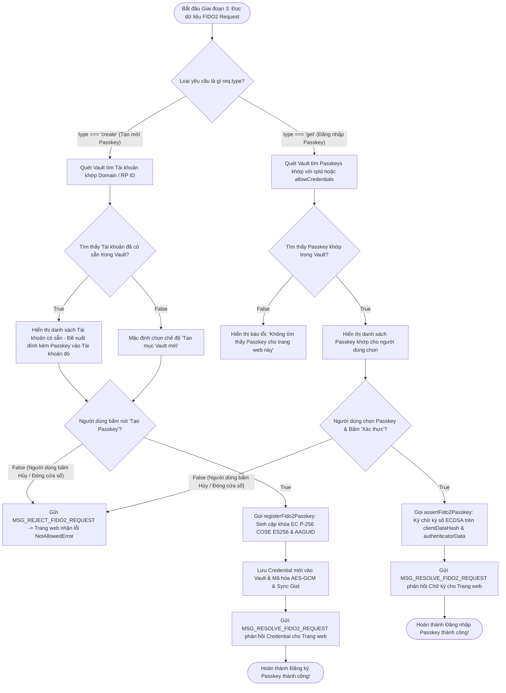

# Tài Liệu Mô Tả Chi Tiết: Chức Năng Cửa Sổ Popup Passkey (FIDO2 / WebAuthn)

Tài liệu này mô tả chi tiết kiến trúc, quy trình xử lý và luồng thuật toán của
cửa sổ **Popup Passkey (FIDO2 Prompt)** trong Gistwarden khi trang web yêu cầu
Tạo (Create) hoặc Đăng nhập (Get) bằng Passkey.

---

## 1. Tổng Quan (Overview)

Passkey (dựa trên chuẩn FIDO2 / WebAuthn) cho phép người dùng đăng nhập không
cần mật khẩu bằng kỹ thuật mật mã khóa công khai (Public-Key Cryptography).

Gistwarden hoạt động như một **FIDO2 Authenticator** chuẩn hóa: tự động chặn các
cuộc gọi WebAuthn API trên trình duyệt, mở cửa sổ Popup FIDO2 riêng biệt, hỗ trợ
tìm kiếm tài khoản khớp tên miền, sinh cặp khóa Elliptic Curve P-256 (ECDSA) an
toàn và lưu trữ trực tiếp trong kho mã hóa Vault.

---

## 🛑 GIAI ĐOẠN 1: Bắt Sự Kiện WebAuthn & Mở Cửa Sổ Popup (WebAuthn Interception Phase)

Giai đoạn này diễn ra khi trang web gọi API chuẩn của trình duyệt
`navigator.credentials.create()` hoặc `navigator.credentials.get()`.

---

## 🔓 GIAI ĐOẠN 2: Xác Thực & Mở Khóa Vault tại Popup (Vault Unlock & Load Phase)

Cửa sổ Popup (`src/features/passkey/Fido2Prompt.tsx`) khởi tạo và duy trì kết
nối Heartbeat để đảm bảo Background Service Worker luôn hoạt động.

---

## ⚙️ GIAI ĐOẠN 3: Phân Loại & Xử Lý Yêu Cầu FIDO2 (Request Processing Phase)

Giai đoạn này xử lý 2 tác vụ FIDO2 chính: **Tạo mới Passkey (Register/Create)**
và **Đăng nhập Passkey (Assert/Get)**.

---

## 📊 TÓM TẮT QUY TRÌNH XỬ LÝ ĐIỀU KIỆN TỔNG HỢP (Decision Matrix)

| Bước    | Câu hỏi điều kiện                                     | Kết quả TRUE                                   | Kết quả FALSE                                      |
| :------ | :---------------------------------------------------- | :--------------------------------------------- | :------------------------------------------------- |
| **2.1** | Kho lưu trữ Vault hiện tại có đang KHÓA không?        | Hiển thị màn hình nhập PIN / Master Password   | Nạp trực tiếp Yêu cầu FIDO2 Pending                |
| **2.2** | Người dùng nhập PIN / Mật khẩu đúng?                  | Mở khóa Vault & Nạp Yêu cầu FIDO2              | Hiển thị thông báo sai mật khẩu                    |
| **3.1** | Loại yêu cầu FIDO2 là `create` (Tạo mới)?             | Chuyển sang luồng Đăng ký Passkey mới          | Chuyển sang luồng Đăng nhập Passkey (`get`)        |
| **3.2** | _(Khi create)_ Tìm thấy Tài khoản sẵn có khớp Domain? | Cho phép đính kèm Passkey vào tài khoản đó     | Mặc định tạo mục Vault Login mới                   |
| **3.3** | _(Khi get)_ Tìm thấy Passkey khớp `rpId` trong Vault? | Hiển thị danh sách Passkey cho người dùng chọn | Hiển thị thông báo không có Passkey tương ứng      |
| **3.4** | Người dùng bấm "Xác nhận" (Tạo/Xác thực)?             | Sinh khóa / Ký chữ ký số & Phản hồi trang web  | Gửi `MSG_REJECT_FIDO2_REQUEST` (`NotAllowedError`) |

---

## 📁 Danh Sách File Mã Nguồn Liên Quan

1. **[`src/features/passkey/Fido2Prompt.tsx`](file:///c:/Users/kien.hm/Desktop/totp%20generate/src/features/passkey/Fido2Prompt.tsx)**:
   SolidJS Component giao diện Cửa sổ Popup FIDO2, quản lý mở khóa PIN/Master
   Password, chuyển đổi tab chọn tài khoản và Heartbeat 5s.
2. **[`src/features/passkey/fido2-service.ts`](file:///c:/Users/kien.hm/Desktop/totp%20generate/src/features/passkey/fido2-service.ts)**:
   Tìm kiếm tài khoản khớp Domain (`findMatchingFido2Accounts`), ghép nối
   Passkey (`findMatchingFido2Credentials`), điều phối lưu trữ Vault và gửi
   message phản hồi.
3. **[`src/features/passkey/passkey-crypto.ts`](file:///c:/Users/kien.hm/Desktop/totp%20generate/src/features/passkey/passkey-crypto.ts)**:
   Xử lý các thuật toán mật mã FIDO2: Sinh cặp khóa Web Crypto ECDSA (P-256),
   chuyển đổi định dạng COSE ES256, ký chữ ký số `secp256r1` (P256) và xử lý
   Base64URL.
4. **[`src/features/passkey/PasskeySelectRow.tsx`](file:///c:/Users/kien.hm/Desktop/totp%20generate/src/features/passkey/PasskeySelectRow.tsx)**:
   Component hiển thị từng dòng Passkey trong danh sách lựa chọn.
5. **[`src/extension/background.ts`](file:///c:/Users/kien.hm/Desktop/totp%20generate/src/extension/background.ts)**:
   Lắng nghe cuộc gọi IPC FIDO2, lưu Yêu cầu chờ vào
   `SESSION_KEY_PENDING_FIDO2_REQUEST`, mở cửa sổ Popup
   (`FIDO2_PROMPT_HEIGHT = 650`) và trả về kết quả cho Content Script.
