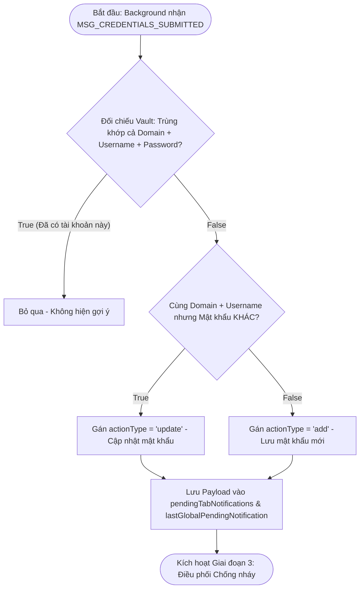
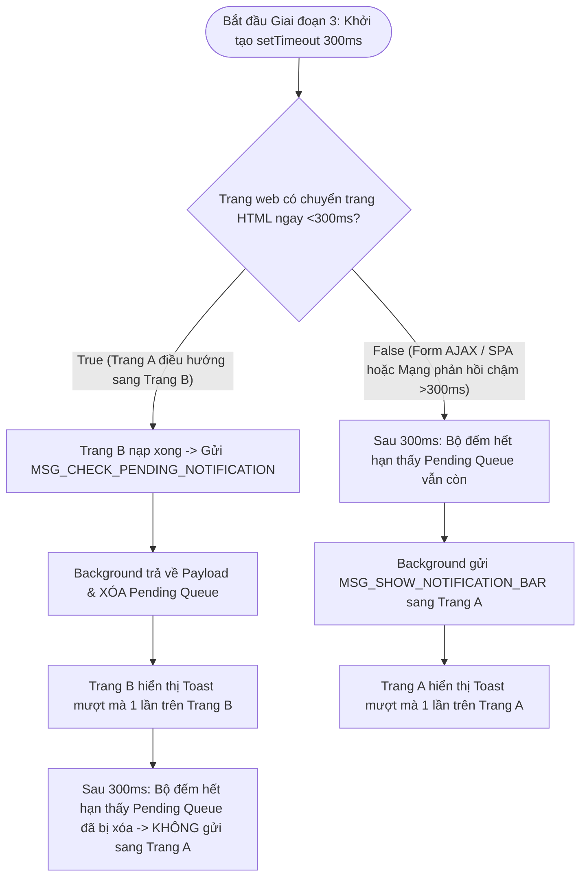
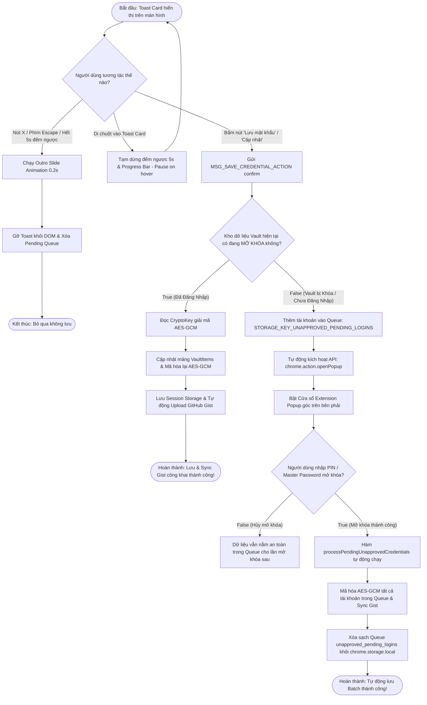

# Tài Liệu Mô Tả Chi Tiết: Chức Năng Gợi Ý Lưu Mật Khẩu (Password Save Suggestion)

Tài liệu này chia nhỏ luồng hoạt động của tính năng **Gợi ý Lưu mật khẩu** thành **4 Giai đoạn chi tiết**, tích hợp các sơ đồ thuật toán (Flowchart) nêu rõ từng bước rẽ nhánh **True / False** và xử lý Edge Cases.

---

## 🛑 GIAI ĐOẠN 1: Bắt Sự Kiện & Trích Xuất Form (Form Detection Phase)

Giai đoạn này diễn ra tại **Content Script** (`src/extension/autofill-core.ts`) lắng nghe các hành vi gửi thông tin của người dùng trên trang web.

---

## 🔄 GIAI ĐOẠN 2: Xử Lý & Kiểm Tra Trùng Lập tại Background (Deduplication Phase)

Giai đoạn này diễn ra tại **Background Service Worker** (`src/extension/background.ts`) để quyết định xem có cần gợi ý hay không và loại gợi ý là gì.

---

## ⚡ GIAI ĐOẠN 3: Điều Phối Hiển Thị Toast Chống Nháy (Zero-Flicker Rendering Phase)

Giai đoạn này giải quyết triệt để vấn đề chuyển trang HTML (Trang A $\rightarrow$ Trang B) khiến Toast bị nháy hoặc hiển thị trùng lặp.

---

## 🎯 GIAI ĐOẠN 4: Phản Hồi Tương Tác & Lưu Mã Hóa (User Interaction & Vault Encryption)

Giai đoạn này xử lý tương tác của người dùng trên Toast Card và luồng lưu trữ an toàn khi Vault đang Mở khóa hoặc bị Khóa.

---

## 📊 TÓM TẮT QUY TRÌNH RẼ NHÁNH TỔNG HỢP (Decision Matrix)

| Bước | Câu hỏi điều kiện | Kết quả TRUE | Kết quả FALSE |
| :--- | :--- | :--- | :--- |
| **1.1** | Form có chứa input `password`? | Trích xuất dữ liệu | Bỏ qua hoàn toàn |
| **1.2** | Đã submit thông tin này trong 1000ms qua? | Bỏ qua (Chống duplicate submit) | Gửi `MSG_CREDENTIALS_SUBMITTED` |
| **2.1** | Trùng cả Domain + Username + Password? | Bỏ qua (Đã có sẵn tài khoản này) | Kiểm tra rẽ nhánh 2.2 |
| **2.2** | Cùng Domain + Username nhưng Mật khẩu KHÁC? | Gán `actionType = "update"` | Gán `actionType = "add"` |
| **3.1** | Trang chuyển hướng HTML sang Trang B trong <300ms? | Hiện Toast 1 lần ở Trang B | Hiện Toast 1 lần ở Trang A sau 300ms |
| **4.1** | Di chuột vào Toast Card? | Tạm dừng 5s timer (Pause on hover) | Tiếp tục đếm ngược 5s |
| **4.2** | Vault hiện tại đang Mở khóa (Unlocked)? | Mã hóa AES-GCM & Sync Gist ngay | Đưa vào Queue & Tự mở Popup |
| **4.3** | Mở khóa Extension Popup thành công? | Tự động rút Queue, lưu Batch & Sync Gist | Giữ Queue an toàn cho lần mở khóa sau |

---

## 📁 Danh Sách File Mã Nguồn Liên Quan

1. **[`src/features/notification/NotificationToast.tsx`](file:///c:/Users/kien.hm/Desktop/totp%20generate/src/features/notification/NotificationToast.tsx)**: SolidJS Component giao diện Toast Card, đếm ngược, pause-on-hover, phím Escape và Native Event Listeners.
2. **[`src/features/notification/notification-bar.tsx`](file:///c:/Users/kien.hm/Desktop/totp%20generate/src/features/notification/notification-bar.tsx)**: Quản lý vòng đời Shadow DOM.
3. **[`src/extension/background.ts`](file:///c:/Users/kien.hm/Desktop/totp%20generate/src/extension/background.ts)**: Điều phối sự kiện submit, hoãn 300ms chống nháy, quản lý Queue và `chrome.action.openPopup()`.
4. **[`src/extension/autofill-core.ts`](file:///c:/Users/kien.hm/Desktop/totp%20generate/src/extension/autofill-core.ts)**: Bắt sự kiện submit form và debounce 1000ms.
5. **[`src/core/types.ts`](file:///c:/Users/kien.hm/Desktop/totp%20generate/src/core/types.ts)** & **[`src/core/i18n.ts`](file:///c:/Users/kien.hm/Desktop/totp%20generate/src/core/i18n.ts)**: Định nghĩa kiểu dữ liệu và từ điển dịch thuật đa ngôn ngữ.
