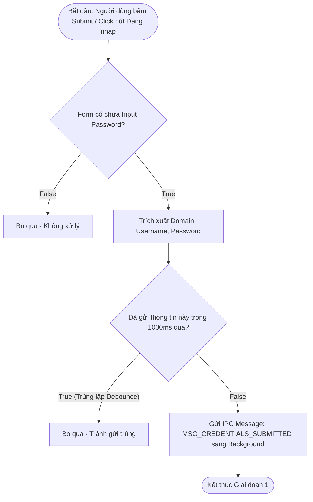
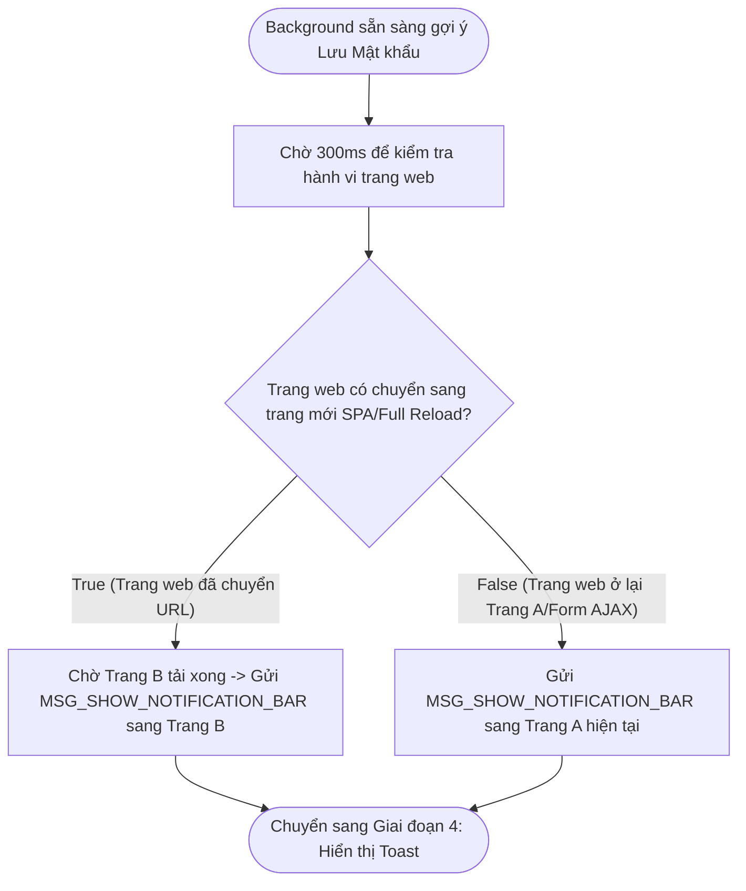
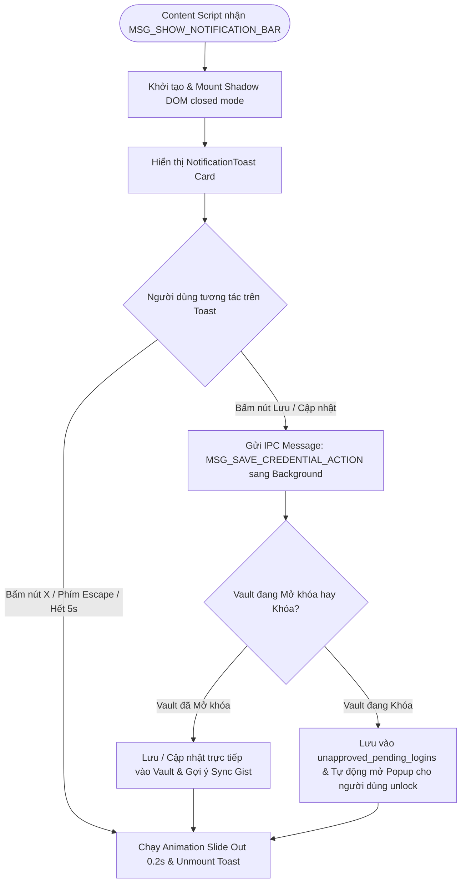

# Tài Liệu Mô Tả Chi Tiết: Chức Năng Gợi Ý Lưu Mật Khẩu (Password Save Suggestion)

Tài liệu mô tả chia nhỏ luồng hoạt động của tính năng **Gợi ý Lưu mật khẩu**
thành **4 Giai đoạn chi tiết**, tích hợp các sơ đồ thuật toán (Flowchart) nêu rõ
từng bước xử lý điều kiện và xử lý Edge Cases.

---

## 🛑 GIAI ĐOẠN 1: Bắt Sự Kiện & Trích Xuất Form (Form Detection Phase)

Giai đoạn này diễn ra tại **Content Script** (`src/extension/autofill-core.ts`)
lắng nghe các hành vi gửi thông tin của người dùng trên trang web.



---

## 🔄 GIAI ĐOẠN 2: Xử Lý & Kiểm Tra Trùng Lập tại Background (Deduplication Phase)

Giai đoạn này diễn ra tại **Background Service Worker**
(`src/extension/background.ts`) để quyết định xem có cần gợi ý hay không và loại
gợi ý là gì.

```mermaid
flowchart TD
    Phase2Start([Bắt đầu: Background nhận MSG_CREDENTIALS_SUBMITTED]) --> CheckTotpCode{Mật khẩu nhập vào là chuỗi 6 chữ số /^\d{6}$/?}
    
    CheckTotpCode -- True (Khả năng cao là mã 2FA TOTP) --> IgnoreTotp[Bỏ qua - Không gợi ý lưu/cập nhật đè mật khẩu thực]
    CheckTotpCode -- False --> CheckExactDup{Đối chiếu Vault: Trùng khớp cả Domain + Username + Password?}
    
    CheckExactDup -- True (Đã có tài khoản này) --> IgnoreDup[Bỏ qua - Không hiện gợi ý]
    CheckExactDup -- False --> CheckPasswordChange{Cùng Domain + Username nhưng Mật khẩu KHÁC?}
    
    CheckPasswordChange -- True --> SetUpdateAction[Gán actionType = 'update' - Cập nhật mật khẩu]
    CheckPasswordChange -- False --> SetAddAction[Gán actionType = 'add' - Lưu mật khẩu mới]
    
    SetUpdateAction --> SavePendingState[Lưu Payload vào pendingTabNotifications & lastGlobalPendingNotification]
    SetAddAction --> SavePendingState
    SavePendingState --> Phase2End([Kích hoạt Giai đoạn 3: Điều phối Chống nháy])
```

---

## ⌛ GIAI ĐOẠN 3: Điều Phối Chống Nháy & Chờ Chuyển Trang (Zero-Flicker Delay Phase)



---

## 🎨 GIAI ĐOẠN 4: Hiển Thị Toast & Phản Hồi Người Dùng (User Interaction Phase)



---

## 📊 TÓM TẮT QUY TRÌNH XỬ LÝ ĐIỀU KIỆN TỔNG HỢP (Decision Matrix)

| Bước    | Câu hỏi điều kiện                                          | Kết quả TRUE                                   | Kết quả FALSE                                |
| :------ | :--------------------------------------------------------- | :--------------------------------------------- | :------------------------------------------- |
| **1.1** | Form submit có chứa Input Password?                        | Trích xuất Username & Password                 | Bỏ qua                                       |
| **1.2** | Chuỗi dữ liệu đã được gửi trong 1000ms qua?                | Bỏ qua (Debounce chống gửi trùng)              | Gửi `MSG_CREDENTIALS_SUBMITTED`              |
| **2.1** | Mật khẩu là chuỗi 6 chữ số (`/^\d{6}$/`)?                  | Bỏ qua (Là mã 2FA TOTP, không gợi ý lưu đè)    | Kiểm tra đối chiếu Vault (2.2)               |
| **2.2** | Vault đã có thông tin giống 100% (Domain + User + Pass)?   | Bỏ qua                                         | Kiểm tra thay đổi Password (2.3)             |
| **2.3** | Vault đã có Domain + User nhưng Password KHÁC?             | Gán `actionType = "update"`                    | Gán `actionType = "add"`                     |
| **3.1** | Trang web chuyển hướng trang sau khi submit?               | Gợi ý trên trang mới sau khi load xong         | Hiển thị Toast trên trang hiện tại sau 300ms |
| **4.1** | Người dùng xác nhận **[ Lưu / Cập nhật ]** khi Vault Khóa? | Lưu tạm vào Hàng đợi & Tự động mở Popup Unlock | Lưu trực tiếp vào Vault                      |

---

## 📁 Danh Sách File Mã Nguồn Cần Cập Nhật

1. **[`src/extension/background.ts`](file:///c:/Users/kien.hm/Desktop/totp%20generate/src/extension/background.ts)**:
   Thêm bộ lọc `/^\d{6}$/.test(creds.password.trim())` trong
   `handleSubmittedCredentials` để tự động gạt bỏ các chuỗi 6 chữ số (mã TOTP
   2FA).
