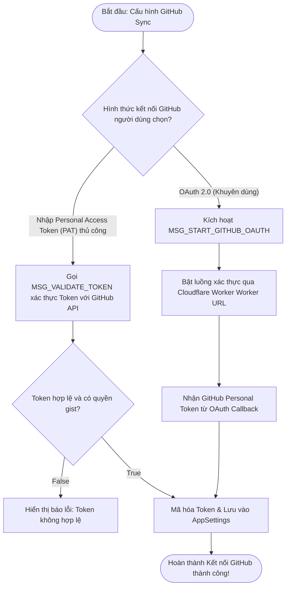
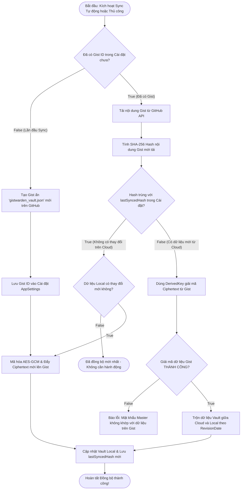

# Tài Liệu Mô Tả Chi Tiết: Chức Năng Đồng Bộ GitHub Gist & Nhập/Xuất Dữ Liệu (Sync & Import/Export)

Tài liệu này mô tả chi tiết kiến trúc, quy trình xử lý và luồng thuật toán của
tính năng **Đồng bộ GitHub Gist** và **Nhập/Xuất Dữ liệu** (CSV & JSON) trong
Gistwarden.

---

## 1. Tổng Quan (Overview)

Gistwarden sử dụng **GitHub Gist** làm hạ tầng lưu trữ đám mây cá nhân hoàn toàn
miễn phí, riêng tư và độc lập:

- Dữ liệu trước khi tải lên Gist được mã hóa **AES-256-GCM** cục bộ bằng
  `DerivedKey` (Argon2id) của người dùng.
- GitHub chỉ nhìn thấy các chuỗi Ciphertext vô nghĩa (Zero-Knowledge Cloud
  Storage).
- **Hỗ trợ Đầy đủ Nhập & Xuất (Import & Export)** cả 2 dạng định dạng **CSV** và
  **JSON**:
  - **Xuất dữ liệu (Export)**: Tùy chọn xuất thành **Browser CSV**, **Bitwarden
    CSV**, hoặc **Gistwarden JSON**.
  - **Nhập dữ liệu (Import)**: Nhận diện và ánh xạ tự động từ **Browser CSV**,
    **Bitwarden CSV**, hoặc **Gistwarden / Bitwarden JSON**.

---

## 🛑 GIAI ĐOẠN 1: Xác Thực GitHub OAuth & Token (GitHub Auth Phase)

---

## 🔄 GIAI ĐOẠN 2: Đồng Bộ 2 Chiều với GitHub Gist (Bi-directional Sync Phase)

---

## 📥 GIAI ĐOẠN 3: Nhập & Xuất Dữ Liệu CSV & JSON (Import & Export Phase)

---

## 📊 TÓM TẮT QUY TRÌNH XỬ LÝ ĐIỀU KIỆN TỔNG HỢP (Decision Matrix)

| Bước    | Câu hỏi điều kiện                              | Kết quả TRUE                                                 | Kết quả FALSE                                       |
| :------ | :--------------------------------------------- | :----------------------------------------------------------- | :-------------------------------------------------- |
| **1.1** | Token GitHub API có hợp lệ và có quyền `gist`? | Mã hóa Token & Lưu Cài đặt                                   | Hiển thị báo lỗi Token không hợp lệ                 |
| **2.1** | Đã có Gist ID trong Cài đặt (AppSettings)?     | Tải nội dung Gist từ GitHub                                  | Tự động tạo Gist ẩn mới trên GitHub                 |
| **2.2** | Hash nội dung Gist trùng với `lastSyncedHash`? | Không có thay đổi từ Cloud $\rightarrow$ Kiểm tra Local      | Có dữ liệu mới từ Cloud $\rightarrow$ Tải & Giải mã |
| **2.3** | Giải mã Ciphertext từ Gist thành công?         | Trộn dữ liệu theo RevisionDate & Lưu Local                   | Báo lỗi Master Password không khớp                  |
| **3.1** | Định dạng Xuất dữ liệu (Export) chọn?          | **Gistwarden JSON**, **Bitwarden CSV**, hoặc **Browser CSV** | N/A                                                 |
| **3.2** | File Nhập (Import) hợp lệ chuẩn CSV/JSON?      | Ánh xạ mục Vault, Validate & Lưu Batch                       | Báo lỗi định dạng file không hợp lệ                 |

---

## 📁 Danh Sách File Mã Nguồn Liên Quan

1. **[`src/features/sync/ExportAccounts.tsx`](file:///c:/Users/kien.hm/Desktop/totp%20generate/src/features/sync/ExportAccounts.tsx)**:
   Giao diện và logic Xuất dữ liệu cả 3 định dạng: **JSON**, **Bitwarden CSV**,
   và **Browser CSV**.
2. **[`src/features/sync/ImportAccounts.tsx`](file:///c:/Users/kien.hm/Desktop/totp%20generate/src/features/sync/ImportAccounts.tsx)**:
   Giao diện Nhập dữ liệu tự động nhận diện file CSV và JSON.
3. **[`src/features/sync/github-api.ts`](file:///c:/Users/kien.hm/Desktop/totp%20generate/src/features/sync/github-api.ts)**:
   Các hàm giao tiếp REST API của GitHub Gist (`createGist`, `updateGist`,
   `getGist`).
4. **[`src/features/sync/github-auth.ts`](file:///c:/Users/kien.hm/Desktop/totp%20generate/src/features/sync/github-auth.ts)**:
   Xử lý luồng GitHub OAuth 2.0 via Cloudflare Worker (`startGithubOAuth`).
5. **[`src/features/sync/sync-service.ts`](file:///c:/Users/kien.hm/Desktop/totp%20generate/src/features/sync/sync-service.ts)**:
   Điều phối đồng bộ 2 chiều (`syncVaultWithGist`, `uploadToGist`,
   `downloadFromGist`).
6. **[`src/features/sync/csv-import.ts`](file:///c:/Users/kien.hm/Desktop/totp%20generate/src/features/sync/csv-import.ts)**:
   Parser RFC 4180 đọc file CSV trình duyệt và Bitwarden CSV.
7. **[`src/features/sync/csv-export.ts`](file:///c:/Users/kien.hm/Desktop/totp%20generate/src/features/sync/csv-export.ts)**:
   Xuất dữ liệu Vault thành chuẩn Bitwarden CSV và Browser CSV.
8. **[`src/features/sync/json-import.ts`](file:///c:/Users/kien.hm/Desktop/totp%20generate/src/features/sync/json-import.ts)**:
   Nhập và ánh xạ file sao lưu JSON.
