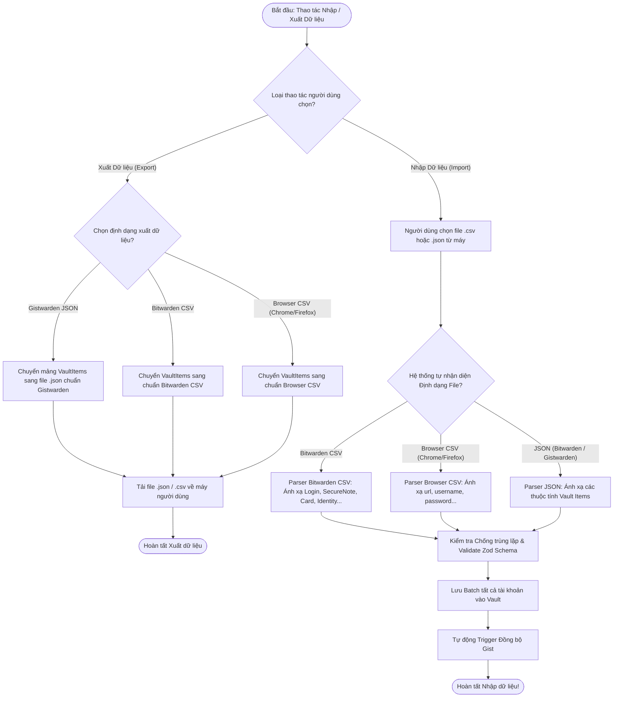

# Tài Liệu Mô Tả Chi Tiết: Chức Năng Đồng Bộ GitHub Gist & Nhập/Xuất Dữ Liệu (Sync & Import/Export)

Tài liệu này mô tả chi tiết kiến trúc, quy trình xử lý và luồng thuật toán của
tính năng **Đồng bộ GitHub Gist** và **Nhập/Xuất Dữ liệu** (CSV & JSON) trong
Gistwarden.

---

## 1. Tổng Quan (Overview)

Gistwarden sử dụng **GitHub Gist** làm hạ tầng lưu trữ đám mây cá nhân hoàn toàn
miễn phí, riêng tư và độc lập:

- Dữ liệu trước khi tải lên Gist được mã hóa **AES-256-GCM** cục bộ bằng
  `DerivedKey` (Argon2id) của người dùng.
- GitHub chỉ nhìn thấy các chuỗi Ciphertext vô nghĩa (Zero-Knowledge Cloud
  Storage).
- **Cơ chế Bảo mật & Giải Mã GitHub Token On-The-Fly (On-Demand Decryption)**:
  - GitHub Token luôn được lưu mã hóa bằng AES-GCM 256-bit trong
    `chrome.storage.local`.
  - **Không lưu Plaintext Token vào Storage**: Plaintext token tuyệt đối không
    được ghi vào `chrome.storage.session` hay bất kỳ bộ nhớ cố định nào.
  - **Giải mã On-The-Fly**: Khi ứng dụng cần gọi GitHub REST API (sync, fetch
    user), hệ thống sẽ đọc `Master Key` từ Session và giải mã Token ngầm trực
    tiếp trên biến RAM tạm thời. Biến này sẽ bị xóa khỏi RAM ngay khi request
    API hoàn tất.
  - **Bảo mật `TRUSTED_CONTEXTS`**: `chrome.storage.session` được cấu hình
    `setAccessLevel({ accessLevel: 'TRUSTED_CONTEXTS' })` để chặn triệt để các
    Content Scripts từ trang web bên thứ ba truy cập vào phiên làm việc.
- **Cơ chế Chống Xung Đột Đổi Mật Khẩu (Pre-download Password Conflict Check)**:
  - Trước khi upload bất kỳ thay đổi nào lên Gist, ứng dụng tự động kéo payload
    mới nhất từ Gist về và giải mã thử bằng Master Key hiện tại.
  - Nếu giải mã thất bại ➔ Phát hiện Master Password đã bị thiết bị khác thay
    đổi ➔ Chặn ngay thao tác ghi đè và báo lỗi `login_title_locked` để người
    dùng đăng xuất/đồng bộ lại.
- **Cơ chế Hợp Nhất Dữ Liệu Thông Minh (Item-level 3-way Merge)**:
  - So sánh và hợp nhất tài khoản giữa Local và Remote dựa trên `id`,
    `creationDate`, `revisionDate` và mốc đồng bộ `store.lastSync`.
- **Cơ chế Kiểm soát Giới hạn Gist (Gist Limits & Rate Limits)**:
  - **Giới hạn dung lượng 10MB**: Kiểm tra dung lượng mã hóa trước khi tải lên.
    Nếu dung lượng két sắt vượt quá 10MB, hệ thống báo lỗi
    `github_error_gist_size_limit` để chặn ghi đè hỏng Gist.
  - **Cảnh báo sớm 5MB**: Khi két sắt tiệm cận 5MB, hệ thống tự động hiển thị
    thông báo cảnh báo nhẹ để người dùng chủ động tối ưu dữ liệu.
  - **Kiểm soát Tần suất Gọi API (Rate Limit)**: Nhận diện phản hồi
    `HTTP 403 / 429` để đưa ra thông báo `github_error_rate_limit` chuẩn xác cho
    người dùng.

---

## 🛑 GIAI ĐOẠN 1: Xác Thực GitHub OAuth & Token (GitHub Auth Phase)


---

## 🔄 GIAI ĐOẠN 2: Đồng Bộ 2 Chiều & Hợp Nhất Dữ Liệu (Bi-directional Sync & Merge Phase)

```mermaid
flowchart TD
    SyncStart([Bắt đầu: Kích hoạt Sync hoặc Save/Delete Item]) --> CheckGistId{Đã có Gist ID trong Cài đặt chưa?}
    
    CheckGistId -- False (Lần đầu Sync) --> CreateNewGist[Tạo Gist ẩn 'gistwarden_vault.json' mới trên GitHub]
    CreateNewGist --> SaveGistIdSettings[Lưu Gist ID vào Cài đặt AppSettings]
    SaveGistIdSettings --> UploadVaultContent
    
    CheckGistId -- True (Đã có Gist) --> DownloadGistContent[Tải nội dung Gist hiện tại từ GitHub API]
    DownloadGistContent --> TryDecryptGist[Giải mã Ciphertext bằng Master Key hiện tại]
    TryDecryptGist --> CheckDecryptSuccess{Giải mã Gist THÀNH CÔNG?}
    
    CheckDecryptSuccess -- False (Pass đã bị máy khác đổi) --> BlockUpload[Chặn Ghi đè & Báo lỗi Mật khẩu Master không khớp]
    CheckDecryptSuccess -- True --> RunMerge[Thực thi mergeVaultItems với store.lastSync]
    
    RunMerge --> MergeStrategy{So sánh Item theo ID}
    MergeStrategy -- Trùng ID --> PickNewerRevision[Giữ Item có revisionDate mới hơn]
    MergeStrategy -- Chỉ có ở Local (creationDate > lastSync) --> KeepLocalItem[Giữ lại: Item mới được tạo ở Local]
    MergeStrategy -- Chỉ có ở Local (creationDate <= lastSync) --> DropLocalItem[Loại bỏ: Item đã bị xóa trên Remote]
    MergeStrategy -- Chỉ có ở Remote --> KeepRemoteItem[Giữ lại: Item mới được tạo trên Remote]
    
    PickNewerRevision --> EncryptFinal[Mã hóa AES-GCM danh sách đã Hợp nhất]
    KeepLocalItem --> EncryptFinal
    DropLocalItem --> EncryptFinal
    KeepRemoteItem --> EncryptFinal
    
    EncryptFinal --> UploadVaultContent[Đẩy Ciphertext mới lên Gist]
    UploadVaultContent --> UpdateLastSync[Cập nhật store.lastSync = Date.now()]
    UpdateLastSync --> SyncComplete([Hoàn tất Đồng bộ & Merge thành công!])
```

---

## 📥 GIAI ĐOẠN 3: Nhập & Xuất Dữ Liệu CSV & JSON (Import & Export Phase)



---

## 📊 TÓM TẮT QUY TRÌNH XỬ LÝ ĐIỀU KIỆN TỔNG HỢP (Decision Matrix)

| Bước    | Câu hỏi điều kiện                              | Kết quả TRUE                                                 | Kết quả FALSE                                       |
| :------ | :--------------------------------------------- | :----------------------------------------------------------- | :-------------------------------------------------- |
| **1.1** | Token GitHub API có hợp lệ và có quyền `gist`? | Mã hóa Token & Lưu Cài đặt                                   | Hiển thị báo lỗi Token không hợp lệ                 |
| **2.1** | Đã có Gist ID trong Cài đặt (AppSettings)?     | Tải nội dung Gist từ GitHub                                  | Tự động tạo Gist ẩn mới trên GitHub                 |
| **2.2** | Giải mã Pre-download Ciphertext từ Gist?       | Tiến hành Hợp nhất (`mergeVaultItems`)                       | Báo lỗi Master Password đã bị đổi từ xa & Chặn Push |
| **2.3** | Item trùng ID giữa Local và Remote?            | Giữ Item có `revisionDate` gần hơn                           | Kiểm tra điều kiện `creationDate` vs `lastSync`     |
| **2.4** | Item Local có `creationDate > lastSync`?       | Giữ lại (Item mới tạo trên Local)                            | Bỏ qua (Item đã bị xóa trên Remote)                 |
| **3.1** | Định dạng Xuất dữ liệu (Export) chọn?          | **Gistwarden JSON**, **Bitwarden CSV**, hoặc **Browser CSV** | N/A                                                 |
| **3.2** | File Nhập (Import) hợp lệ chuẩn CSV/JSON?      | Ánh xạ mục Vault, Validate & Lưu Batch                       | Báo lỗi định dạng file không hợp lệ                 |

---

## 📁 Danh Sách File Mã Nguồn Liên Quan

1. **[`src/features/sync/sync-merge.ts`](file:///c:/Users/kien.hm/Desktop/totp%20generate/src/features/sync/sync-merge.ts)**:
   Hàm thuần khiết `mergeVaultItems` xử lý hợp nhất dữ liệu 3-way giữa Local và
   Remote.
2. **[`src/features/sync/sync-utils.ts`](file:///c:/Users/kien.hm/Desktop/totp%20generate/src/features/sync/sync-utils.ts)**:
   Tích hợp pre-download check kiểm tra mật khẩu & gọi `mergeVaultItems` trước
   khi upload Gist.
3. **[`src/features/sync/ExportAccounts.tsx`](file:///c:/Users/kien.hm/Desktop/totp%20generate/src/features/sync/ExportAccounts.tsx)**:
   Giao diện và logic Xuất dữ liệu cả 3 định dạng: **JSON**, **Bitwarden CSV**,
   và **Browser CSV**.
4. **[`src/features/sync/ImportAccounts.tsx`](file:///c:/Users/kien.hm/Desktop/totp%20generate/src/features/sync/ImportAccounts.tsx)**:
   Giao diện Nhập dữ liệu tự động nhận diện file CSV và JSON.
5. **[`src/features/sync/github-api.ts`](file:///c:/Users/kien.hm/Desktop/totp%20generate/src/features/sync/github-api.ts)**:
   Các hàm giao tiếp REST API của GitHub Gist (`createGist`, `updateGist`,
   `getGist`).
6. **[`src/features/sync/sync-service.ts`](file:///c:/Users/kien.hm/Desktop/totp%20generate/src/features/sync/sync-service.ts)**:
   Điều phối đồng bộ 2 chiều (`syncVault`, `downloadFromGist`).
