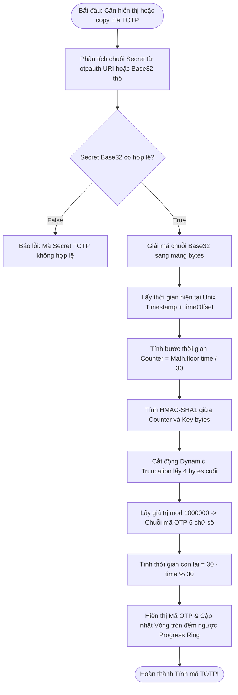
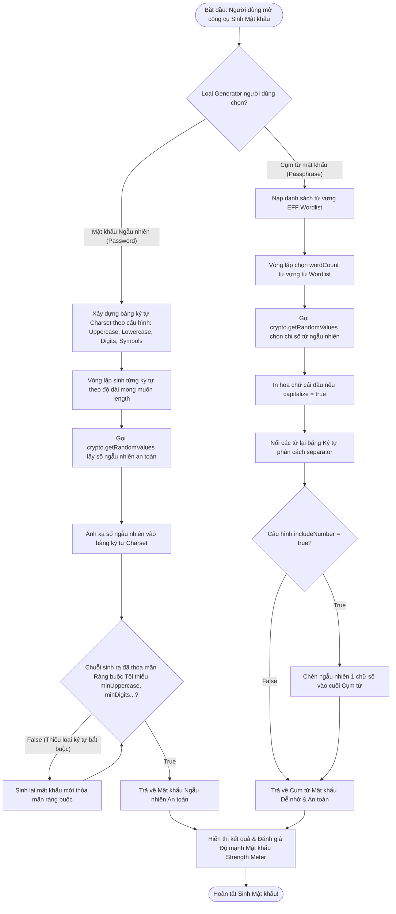

# Tài Liệu Mô Tả Chi Tiết: Chức Năng Mã Xác Thực TOTP (2FA) & Trình Sinh Mật Khẩu (Password & Passphrase Generator)

Tài liệu này mô tả chi tiết kiến trúc, công thức toán học mật mã và luồng thuật
toán rẽ nhánh **True / False** của công cụ **Tính mã TOTP 2FA** và **Trình sinh
Mật khẩu / Cụm mật khẩu an toàn (Generator)** trong Gistwarden.

---

## 1. Tổng Quan (Overview)

1. **Bộ tính mã TOTP (Time-based One-Time Password)**:
   - Tuân thủ chuẩn quốc tế **RFC 6238** (HMAC-SHA1, chu kỳ 30 giây, 6 chữ số).
   - Hỗ trợ phân tích chuỗi URI dạng `otpauth://totp/...` hoặc mã Base32 Secret
     thô.
   - Tự động tính toán và hiển thị thanh đếm ngược đĩa tròn (Progress Ring 30s).
   - Hỗ trợ cấu hình lệch giờ máy chủ `timeOffset` (Drift Correction).

2. **Trình sinh Mật khẩu & Cụm mật khẩu (Generator Engine)**:
   - Sinh chuỗi Mật khẩu ngẫu nhiên (Random Password) hoặc Cụm từ mật khẩu
     (Passphrase / EFF Wordlist).
   - Sử dụng bộ sinh số ngẫu nhiên an toàn tuyệt đối của trình duyệt
     `crypto.getRandomValues()` (`getRandomBoundedInt`).
   - Đảm bảo tuân thủ nghiêm ngặt các ràng buộc tối thiểu (tối thiểu chữ hoa,
     chữ thường, số, ký tự đặc biệt).

---

## 🛑 GIAI ĐOẠN 1: Thuật Toán Tính Mã TOTP 2FA (TOTP Engine Phase)

---

## 🎲 GIAI ĐOẠN 2: Trình Sinh Mật Khẩu & Cụm Mật Khẩu (Generator Engine Phase)

---

## 📊 TÓM TẮT QUY TRÌNH RẼ NHÁNH TỔNG HỢP (Decision Matrix)

| Bước    | Câu hỏi điều kiện                                                                 | Kết quả TRUE                             | Kết quả FALSE                        |
| :------ | :-------------------------------------------------------------------------------- | :--------------------------------------- | :----------------------------------- |
| **1.1** | Chuỗi TOTP Secret Base32 hợp lệ?                                                  | Giải mã Base32, tính HMAC-SHA1 & Mã 6 số | Hiển thị báo lỗi Secret không hợp lệ |
| **2.1** | Mật khẩu sinh ra thỏa mãn các ràng buộc tối thiểu (`minDigits`, `minSymbols`...)? | Chấp nhận Mật khẩu & Hiển thị            | Tự động sinh lại chuỗi mới đạt chuẩn |
| **2.2** | Passphrase có bật tùy chọn chèn chữ số (`includeNumber`)?                         | Chèn chữ số ngẫu nhiên vào Cụm từ        | Giữ nguyên cụm từ từ Wordlist        |

---

## 📁 Danh Sách File Mã Nguồn Liên Quan

1. **[`src/core/crypto.ts`](file:///c:/Users/kien.hm/Desktop/totp%20generate/src/core/crypto.ts)**:
   Hàm tính toán mã TOTP HMAC-SHA1 (`generateTotpCode`, `parseTotpSecret`).
2. **[`src/features/generator/generator-utils.ts`](file:///c:/Users/kien.hm/Desktop/totp%20generate/src/features/generator/generator-utils.ts)**:
   Bộ sinh Mật khẩu ngẫu nhiên (`generatePassword`), Cụm từ
   (`generatePassphrase`) và hàm sinh số ngẫu nhiên an toàn tuyệt đối
   (`getRandomBoundedInt`).
3. **[`src/features/generator/Generator.tsx`](file:///c:/Users/kien.hm/Desktop/totp%20generate/src/features/generator/Generator.tsx)**:
   Component giao diện công cụ Generator, tùy chỉnh độ dài và thanh đánh giá độ
   mạnh Mật khẩu.
