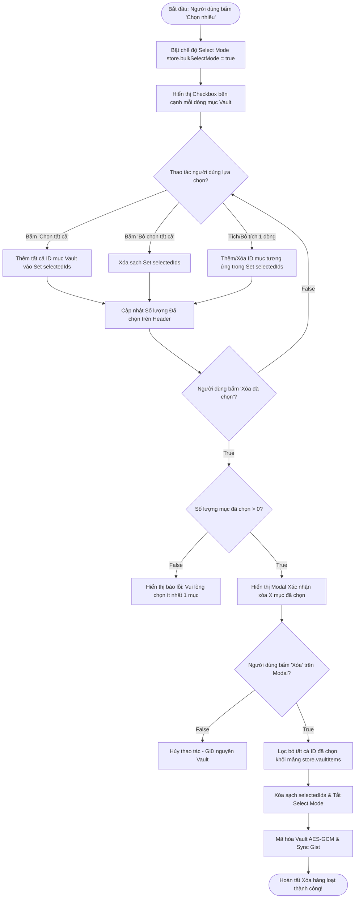

# Tài Liệu Mô Tả Chi Tiết: Chức Năng Quản Lý Kho Vault & Thao Tác Hàng Loạt (Vault Management & Bulk Operations)

Tài liệu này mô tả chi tiết kiến trúc, phân loại mục dữ liệu và luồng thuật toán
xử lý điều kiện của tính năng **Quản lý Kho Vault** và **Thao tác Hàng loạt
(Bulk Select / Bulk Delete)** trong Gistwarden.

---

## 1. Tổng Quan (Overview)

Gistwarden hỗ trợ quản lý 5 loại mục dữ liệu Vault (Vault Item Types) với cấu
trúc phân loại chuẩn hóa:

1. **Login (1)**: Tài khoản Đăng nhập (Username, Password, URIs, TOTP, FIDO2
   Passkeys).
2. **SecureNote (2)**: Ghi chú Bảo mật (Notes text).
3. **Card (3)**: Thẻ Ngân hàng / Tín dụng (Cardholder, Number, Brand, ExpMonth,
   ExpYear, Code).
4. **Identity (4)**: Thông tin Cá nhân / Định danh (Title, Name, SSN, Passport,
   Email, Phone, Address).
5. **SshKey (5)**: Khóa SSH Keys (OpenSSH Private Key, Public Key, Passphrase,
   Fingerprint).

Ngoài ra, ứng dụng cung cấp chế độ **Chọn nhiều (Select Mode)** hỗ trợ chọn từng
mục, Chọn tất cả (Select All), Bỏ chọn tất cả (Deselect All) và Xóa hàng loạt
(Bulk Delete) kèm Hộp thoại xác nhận (Confirmation Modal).

---

## 🛑 GIAI ĐOẠN 1: Quản Lý Mục Vault Single Item (CRUD & Clone Phase)

```mermaid
flowchart TD
    ItemOpStart([Bắt đầu: Thao tác trên Mục Vault đơn lẻ]) --> CheckOpType{Loại thao tác người dùng chọn?}
    
    %% Tạo / Sửa mục
    CheckOpType -- Tạo mới / Chỉnh sửa Mục --> ValidateFormInput[Validate dữ liệu form bằng Zod Schema]
    ValidateFormInput --> CheckInputValid{Dữ liệu form hợp lệ?}
    CheckInputValid -- False --> ShowFormError[Hiển thị thông báo lỗi từng trường]
    CheckInputValid -- True --> EncryptAndSaveVault[Cập nhật revisionDate & Mã hóa Vault AES-GCM]
    EncryptAndSaveVault --> AutoSyncGist[Tự động Sync GitHub Gist]
    AutoSyncGist --> SaveOpEnd([Hoàn tất Lưu mục Vault])
    
    %% Nhân bản mục (Clone)
    CheckOpType -- Nhân bản (Clone) --> DuplicateItem[Sao chép thông tin mục hiện tại]
    DuplicateItem --> AppendCloneSuffix[Thêm hậu tố ' (Bản sao)' vào Tên mục]
    AppendCloneSuffix --> AssignNewUUID[Tạo ngẫu nhiên UUID id mới]
    AssignNewUUID --> EncryptAndSaveVault
    
    %% Xóa mục đơn lẻ
    CheckOpType -- Xóa Mục đơn --> ShowConfirmModal[Hiển thị Modal Xác nhận xóa]
    ShowConfirmModal --> CheckUserConfirmDelete{Người dùng bấm Xác nhận?}
    CheckUserConfirmDelete -- False --> CancelDelete[Hủy thao tác - Giữ nguyên Vault]
    CheckUserConfirmDelete -- True --> RemoveItemArray[Xóa mục khỏi mảng store.vaultItems]
    RemoveItemArray --> EncryptAndSaveVault
```

---

## 🔄 GIAI ĐOẠN 2: Chế Độ Chọn Nhiều & Xóa Hàng Loạt (Bulk Operations Phase)



---

## 📊 TÓM TẮT QUY TRÌNH XỬ LÝ ĐIỀU KIỆN TỔNG HỢP (Decision Matrix)

| Bước    | Câu hỏi điều kiện                              | Kết quả TRUE                                | Kết quả FALSE                        |
| :------ | :--------------------------------------------- | :------------------------------------------ | :----------------------------------- |
| **1.1** | Dữ liệu form nhập liệu hợp lệ theo Zod Schema? | Mã hóa Vault AES-GCM & Sync Gist            | Báo lỗi từng trường nhập liệu        |
| **1.2** | Người dùng bấm "Xác nhận" xóa mục đơn lẻ?      | Xóa khỏi Vault, Mã hóa & Sync Gist          | Hủy thao tác - Giữ nguyên Vault      |
| **2.1** | Người dùng bấm "Chọn tất cả" (Select All)?     | Thêm tất cả ID VaultItems vào `selectedIds` | N/A                                  |
| **2.2** | Số lượng mục đã chọn `selectedIds.size > 0`?   | Hiển thị Hộp thoại Xác nhận xóa hàng loạt   | Báo lỗi: Vui lòng chọn ít nhất 1 mục |
| **2.3** | Người dùng bấm "Xóa" trên Hộp thoại Xác nhận?  | Lọc bỏ các mục đã chọn, Reset Mode & Sync   | Hủy thao tác - Giữ nguyên Vault      |

---

## 📁 Danh Sách File Mã Nguồn Liên Quan

1. **[`src/features/vault/Vault.tsx`](file:///c:/Users/kien.hm/Desktop/totp%20generate/src/features/vault/Vault.tsx)**:
   Component giao diện trang Vault chính, tìm kiếm, lọc loại mục và thanh công
   cụ Bulk Select Mode.
2. **[`src/features/vault/VaultItemRow.tsx`](file:///c:/Users/kien.hm/Desktop/totp%20generate/src/features/vault/VaultItemRow.tsx)**:
   Component hiển thị từng dòng mục Vault kèm Checkbox chọn nhiều.
3. **[`src/features/vault/ItemEdit.tsx`](file:///c:/Users/kien.hm/Desktop/totp%20generate/src/features/vault/ItemEdit.tsx)**:
   Form thêm mới và chỉnh sửa thông tin các loại mục Vault.
4. **[`src/features/vault/vault-service.ts`](file:///c:/Users/kien.hm/Desktop/totp%20generate/src/features/vault/vault-service.ts)**:
   Dịch vụ lưu mục (`saveItem`), xóa mục (`deleteItem`), nhân bản mục
   (`cloneItem`) và xóa hàng loạt.
