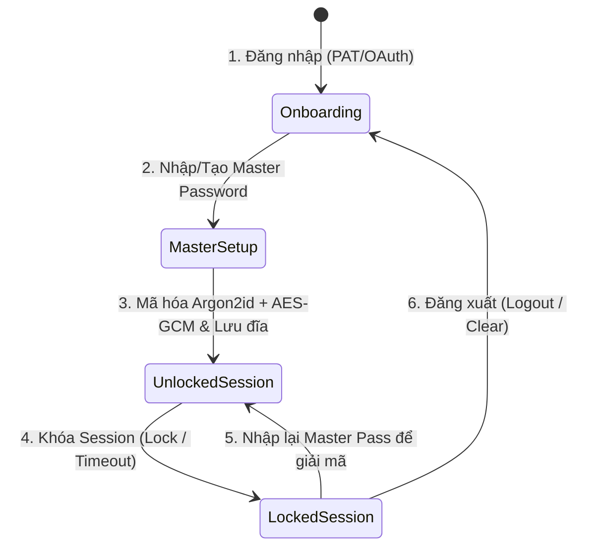
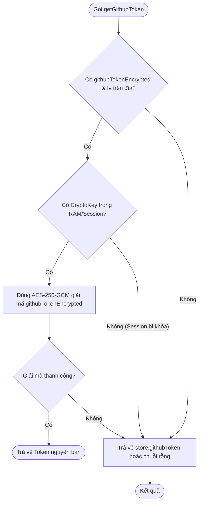

# Kiến trúc Vòng đời Bảo mật & Mã hóa dữ liệu (Security Lifecycle Architecture)

Tài liệu này mô tả chi tiết nguyên lý bảo mật, mô hình **Zero-Knowledge**, thuật
toán mã hóa Argon2id và **vòng đời hoạt động của GitHub Token** trong ứng dụng
Gistwarden.

---

## 1. Mô hình Bảo mật Tổng quan (Zero-Knowledge Architecture)

Gistwarden hoạt động theo mô hình **Zero-Knowledge (Không lưu trữ mật khẩu
gốc)**:

- **Không lưu Mật khẩu Master**: Mật khẩu Master của người dùng **không bao
  giờ** được ghi xuống đĩa (`storage.local`) hay gửi qua mạng.
- **Mã hóa hoàn toàn phía Client (End-to-End Encryption)**: Mọi dữ liệu nhạy cảm
  (Két mật khẩu, TOTP Secret, GitHub PAT/OAuth Token) đều được mã hóa bằng thuật
  toán **AES-256-GCM** tại máy người dùng trước khi lưu xuống đĩa hoặc đồng bộ
  lên GitHub Gist.
- **GitHub Gist mã hóa**: File Gist trên server GitHub của người dùng chỉ chứa
  chuỗi Ciphertext đã mã hóa. GitHub hoặc bất kỳ ai có link Gist cũng không thể
  đọc được dữ liệu nếu không có Mật khẩu Master.

---

## 2. Quản lý Khóa & Thuật toán Mã hóa

| Thành phần                     | Thuật toán / Thư viện              | Thông số chi tiết                                             | Chức năng                                        |
| :----------------------------- | :--------------------------------- | :------------------------------------------------------------ | :----------------------------------------------- |
| **Key Derivation**             | **`Argon2id`** (`hash-wasm` WASM)  | Iterations: 3, Memory: 64MB (65536 KB), Hash Length: 32 bytes | Sinh khóa mã hóa từ Mật khẩu Master              |
| **Encryption Algo**            | **`AES-256-GCM`** (Web Crypto API) | `crypto.subtle.encrypt` / `decrypt`                           | Mã hóa Két sắt và GitHub Token                   |
| **Salt**                       | `crypto.getRandomValues`           | 16 bytes ngẫu nhiên                                           | Ngăn chặn tấn công Rainbow Table                 |
| **IV (Initialization Vector)** | `crypto.getRandomValues`           | 12 bytes ngẫu nhiên                                           | Đảm bảo tính duy nhất cho mỗi lần mã hóa AES-GCM |

---

## 3. Chi tiết Vòng đời Bảo mật của GitHub Token

GitHub Token (PAT hoặc OAuth Token) trải qua **5 giai đoạn** trong vòng đời bảo
mật:



---

### Giai đoạn 1: Onboarding (Chưa có Master Password)

- **Bối cảnh**: Người dùng vừa dán PAT thủ công hoặc đăng nhập thành công qua
  nút **Sign in with GitHub (OAuth)**.
- **Trạng thái**: Người dùng chưa nhập hoặc chưa đặt Mật khẩu Master, do đó
  **chưa có Khóa mã hóa (`CryptoKey`)** trong RAM.
- **Xử lý Bảo mật**:
  - Token được kiểm tra tính hợp lệ qua GitHub API (`/user`).
  - Token nằm **tạm thời trong bộ nhớ RAM (`store.githubToken`)** của Popup và
    Background Process để phục vụ việc kiểm tra Gist trên GitHub.
  - Token **tuyệt đối KHÔNG được ghi unencrypted xuống đĩa**
    (`chrome.storage.local`).

---

### Giai đoạn 2: Khởi tạo/Mở khóa Lần đầu (Encryption Phase)

- **Bối cảnh**: Người dùng nhập Mật khẩu Master ở màn hình Tạo mới hoặc Mở khóa.
- **Xử lý Bảo mật**:
  1. Thuật toán **`Argon2id`** (với 64MB memory, 3 iterations) kết hợp Mật khẩu
     Master và Salt để sinh ra Khóa mã hóa `CryptoKey` (`AES-GCM`).
  2. Hệ thống gọi `encryptData(token, key)` để mã hóa Token.
  3. Kết quả thu được gồm `githubTokenEncrypted` (Ciphertext) và `githubTokenIv`
     (Vector khởi tạo) được lưu bền vững vào `chrome.storage.local`.
  4. Token gốc nằm trong RAM sẽ được làm sạch khi khóa session.

---

### Giai đoạn 3: Trạng thái Khóa Session (Locked State)

- **Bối cảnh**: Người dùng bấm nút **Khoá két**, ứng dụng tự động khóa do
  **Timeout**, hoặc tắt trình duyệt.
- **Xử lý Bảo mật**:
  1. **Xóa sạch Key giải mã**: Hàm `clearDerivedKey()` xóa sạch `CryptoKey` khỏi
     RAM và Session Storage.
  2. **Xóa sạch RAM**: `setStore({ githubToken: "", isLocked: true })` xóa sạch
     Token nguyên bản khỏi bộ nhớ RAM (`store`).
  3. **Trạng thái lưu trữ**:
     - **Trên đĩa (`storage.local`)**: Chỉ còn lại bản mã hóa
       `githubTokenEncrypted` + `githubTokenIv`.
     - **Trong RAM**: `store.githubToken === ""`.
  - **An toàn tuyệt đối**: Ngay cả khi máy tính bị lộ bộ nhớ RAM hoặc bị quét ổ
    đĩa, kẻ tấn công cũng chỉ thu được chuỗi mã hóa vô nghĩa nếu không có Mật
    khẩu Master.

---

### Giai đoạn 4: Mở khóa lại (Re-unlock & Dynamic Decryption)

- **Bối cảnh**: Người dùng mở ứng dụng và nhập lại Mật khẩu Master.
- **Xử lý Bảo mật**:
  1. Người dùng nhập Mật khẩu Master.
  2. Thuật toán **`Argon2id`** tái tạo `CryptoKey` từ Mật khẩu Master + Salt
     (mỗi lần mở khóa đều tạo lại Key trực tiếp từ mật khẩu vừa nhập).
  3. Hàm `getGithubToken()` được gọi để giải mã Token khi cần thực hiện các giao
     tác với GitHub API:
     ```typescript
     export async function getGithubToken(): Promise<string> {
       const settingsRes = await getAllSettings();
       if (settingsRes.isOk()) {
         const settings = settingsRes.value;
         if (settings.githubTokenEncrypted && settings.githubTokenIv) {
           const key = await getSessionKey();
           if (key) {
             const decryptRes = await decryptData(
               settings.githubTokenEncrypted,
               settings.githubTokenIv,
               key,
             );
             if (decryptRes.isOk()) {
               return decryptRes.value; // Giải mã động trong thời gian thực
             }
           }
         }
       }
       return store.githubToken || "";
     }
     ```

---

### Giai đoạn 5: Đăng xuất Hoàn toàn (Logout / Purge)

- **Bối cảnh**: Người dùng bấm **Đăng xuất (Logout)** trong Cài đặt.
- **Xử lý Bảo mật**:
  1. Gọi `clearDerivedKey()` xóa sạch Khóa giải mã trong RAM.
  2. Gọi `clearLocal()` xóa toàn bộ dữ liệu trong `chrome.storage.local` (Bao
     gồm `githubTokenEncrypted`, `githubTokenIv`, `salt`, `gistId`).
  3. Gọi `clearSession()` xóa toàn bộ Session Storage.
  4. Đưa `store` về trạng thái ban đầu (`githubConfigured: false`,
     `githubToken: ""`).

---

## 4. Sơ đồ Luồng giải mã Token (`getGithubToken`)



---

## 5. Kết luận

Kiến trúc vòng đời bảo mật này đảm bảo:

- **Sử dụng Argon2id tiên tiến**: Kháng tấn công GPU/ASIC vượt trội so với
  PBKDF2 nhờ yêu cầu bộ nhớ 64MB.
- **Tính riêng tư cao nhất**: GitHub Token luôn ở trạng thái mã hóa AES-256-GCM
  khi lưu trên ổ đĩa.
- **Không đọng vết unencrypted**: Không lưu Token chưa mã hóa vào Session
  Storage hay Local Storage.
- **Truy xuất tập trung**: Mọi thao tác lấy Token đều đi qua duy nhất một hàm
  `getGithubToken()`.
