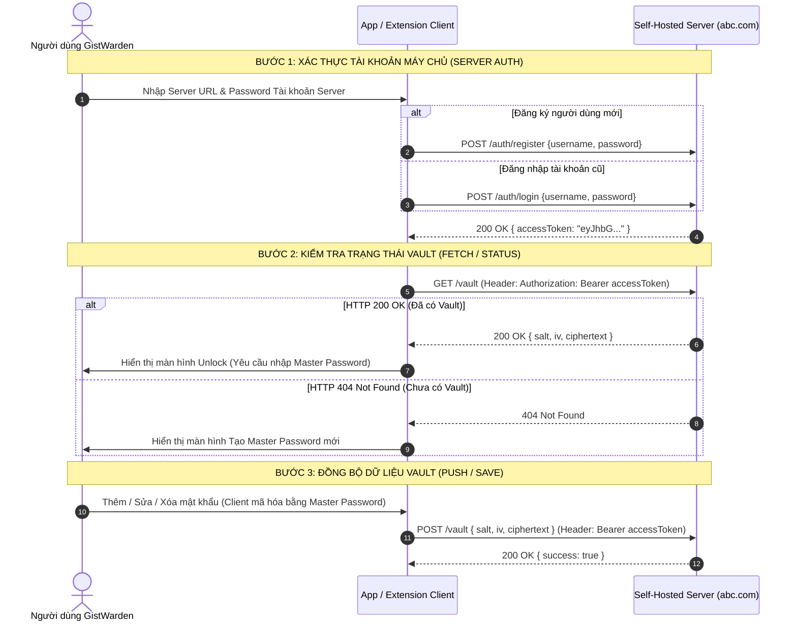

# 📘 Tài Liệu Kỹ Thuật & Hướng Dẫn Chi Tiết: Self-Hosted Server Provider

**File Path**: `docs/self_hosted_server_spec.md`  
**Dự án**: GistWarden  
**Phiên bản**: 1.0.0  
**Trạng thái**: Specification & Comprehensive Integration Guide  

---

## 📑 Mục Lục
1. [Tổng Quan Kiến Trúc & Bảo Mật](#1-tổng-quan-kiến-trúc--bảo-mật)
2. [Chi Tiết Tất Cả Các REST API Endpoints](#2-chi-tiết-tất-cả-các-rest-api-endpoints)
   - [2.1 POST /auth/register](#21-post-authregister---đăng-ký-tài-khoản)
   - [2.2 POST /auth/login](#22-post-authlogin---đăng-nhập)
   - [2.3 GET /user](#23-get-user---xác-thực-token--lấy-thông-tin-người-dùng)
   - [2.4 GET /vault](#24-get-vault---đọc-vault--kiểm-tra-trạng-thái-standard-vault-payload)
   - [2.5 POST /vault](#25-post-vault---lưu--cập-nhật-vault-standard-vault-payload)
   - [2.6 DELETE /vault](#26-delete-vault---xóa-vault)
3. [Hướng Dẫn Chi Tiết Tất Cả Mã Trạng Thái HTTP (Status Codes Guide)](#3-hướng-dẫn-chi-tiết-tất-cả-mã-trạng-thái-http-status-codes-guide)
4. [Ma Trận Phản Ứng Mã Lỗi & Ánh Xạ i18n (Error Codes & Client Response Matrix)](#4-ma-trận-phản-ứng-mã-lỗi--ánh-xạ-i18n-error-codes--client-response-matrix)
5. [Ví Dụ Triển Khai Server Hoàn Chỉnh (Node.js Reference Implementation)](#5-ví-dụ-triển-khai-server-hoàn-chỉnh-nodejs-reference-implementation)

---

## 1. Tổng Quan Kiến Trúc & Bảo Mật

### 1.1 Mục đích
Tính năng **Self-Hosted Server Provider** cho phép người dùng vận hành máy chủ cá nhân (VPS, Docker, NAS, Cloudflare Workers...) làm nơi lưu trữ và đồng bộ dữ liệu mã hóa cho GistWarden với cấu trúc JSON thực tế (`salt`, `iv`, `ciphertext`).

### 1.2 Nguyên tắc Mã hóa Đầu-cuối (E2EE)
* **Tách biệt Đăng nhập Server vs Giải mã Vault**:
  * `server_account_password`: Dùng cho API `/auth/register` và `/auth/login` để lấy `accessToken` (Bearer Token).
  * `master_password`: Dùng để mã hóa/giải mã Vault tại Client. **Máy chủ Self-Host không bao giờ biết hay lưu giữ Master Password này.**
* **Pure Encrypted JSON Payload Standard**: Dữ liệu lưu truyền là một JSON Object chứa 3 trường chuẩn:
  * `salt`: Chuỗi muối PBKDF2 (Base64).
  * `iv`: Vector khởi tạo ngẫu nhiên 12-bytes cho AES-GCM (Base64).
  * `ciphertext`: Dữ liệu mã hóa AES-256-GCM (Base64).

### 1.3 ☁️ Máy Chủ Cloudflare Worker Sẵn Dùng (Ready-to-Use Public Server)
Nếu bạn không muốn sử dụng GitHub Gist hay Local Storage, đồng thời không có điều kiện hoặc nhu cầu tự thuê VPS/vận hành máy chủ riêng, GistWarden đã triển khai sẵn một máy chủ **Cloudflare Worker + Cloudflare D1 (Serverless SQLite)** chính thức tại:

* **Server Base URL**: `https://gistwarden.uongsuadaubung.workers.dev`
* **Cơ chế lưu trữ**: Cloudflare D1 Database phân tán toàn cầu (Region APAC, latency cực thấp < 10ms).
* **Bảo mật tuyệt đối**: Nhờ cơ chế **Mã hóa đầu cuối (E2EE)**, toàn bộ két mật khẩu được mã hóa bằng Master Password ngay trên trình duyệt của bạn trước khi đẩy lên máy chủ. Máy chủ và cơ sở dữ liệu chỉ lưu trữ các chuỗi Base64 mã hóa vô nghĩa (`salt`, `iv`, `ciphertext`), hoàn toàn không thể đọc hay biết được mật khẩu của bạn.
* **Cách sử dụng ngay**: Tại giao diện GistWarden, chọn phương thức **Máy chủ cá nhân (Self-Hosted)** $\rightarrow$ Nhập URL `https://gistwarden.uongsuadaubung.workers.dev` $\rightarrow$ Đăng ký tài khoản và bắt đầu đồng bộ tức thì mà không cần bất kỳ thao tác cài đặt máy chủ nào.



---

## 2. Chi Tiết Tất Cả Các REST API Endpoints

**Base URL**: `https://<domain_hoac_ip>` (hoặc `https://<domain_hoac_ip>/api`)  
**Common Content-Type**: `application/json`

> 💡 **Quy ước Tiền tố `/api`**: Máy chủ chính thức Cloudflare Worker và kiến trúc khuyến nghị hỗ trợ song hành cả cấu trúc có tiền tố `/api/...` (ví dụ `POST /api/auth/register`, `GET /api/user`, `GET /api/vault`) lẫn cấu trúc trực tiếp `/*`. Người dùng cấu hình Server URL trên GistWarden có đuôi `/api` hay không đều được hệ thống nhận diện chính xác.

### 🌐 Cấu Hình CORS (Cross-Origin Resource Sharing) Bắt Buộc

Khi người dùng sử dụng ứng dụng GistWarden phiên bản Web (trên GitHub Pages `https://uongsuadaubung.github.io`) hoặc Chrome Extension / Mobile Webview, trình duyệt sẽ tự động gửi truy vấn kiểm tra CORS preflight (`OPTIONS`).

Máy chủ Self-Host **BẮT BUỘC** phải trả về các HTTP Headers CORS sau để không bị trình duyệt chặn kết nối:

* **`Access-Control-Allow-Origin`**: `https://uongsuadaubung.github.io` (hoặc `*` để cho phép mọi Origin)
* **`Access-Control-Allow-Methods`**: `GET, POST, DELETE, OPTIONS`
* **`Access-Control-Allow-Headers`**: `Authorization, Content-Type`
* **`Access-Control-Max-Age`**: `86400` (tối ưu số lần gửi request OPTIONS)

---

### 2.1 `POST /auth/register` — Đăng Ký Tài Khoản

Tạo tài khoản người dùng mới trên máy chủ Self-Host.

* **Headers**: `Content-Type: application/json`
* **Request Body**:
  ```json
  {
    "username": "user123",
    "password": "server_account_password_123"
  }
  ```
* **Response Thành công (`200 OK`)**:
  ```json
  {
    "accessToken": "eyJhbGciOiJIUzI1NiIsInR5cCI6IkpXVCJ9...",
    "username": "user123"
  }
  ```

---

### 2.2 `POST /auth/login` — Đăng Nhập

Đăng nhập tài khoản server đã có để lấy Access Token.

* **Headers**: `Content-Type: application/json`
* **Request Body**:
  ```json
  {
    "username": "user123",
    "password": "server_account_password_123"
  }
  ```
* **Response Thành công (`200 OK`)**:
  ```json
  {
    "accessToken": "eyJhbGciOiJIUzI1NiIsInR5cCI6IkpXVCJ9...",
    "username": "user123"
  }
  ```

---

### 2.3 `GET /user` — Xác Thực Token & Lấy Thông Tin Người Dùng

Được Client sử dụng để kiểm tra xem Access Token hiện tại có còn hợp lệ hay không, đồng thời lấy thông tin Username và Avatar người dùng.

* **Headers**: `Authorization: Bearer <accessToken>`
* **Response Thành công (`200 OK`)**:
  ```json
  {
    "username": "user123",
    "avatarUrl": "https://example.com/avatar.png"
  }
  ```
* **Response Lỗi (`401 Unauthorized` — Token hết hạn hoặc không hợp lệ)**:
  ```json
  {
    "error": "unauthorized",
    "message": "Access token is missing, expired or invalid"
  }
  ```

---

### 2.4 `GET /vault` — Đọc Vault & Kiểm Tra Trạng Thái (Standard Vault Payload)

Được Client sử dụng cho 3 mục đích: Kiểm tra Token, Xác định Vault cũ/mới, Tải Vault về.

* **Headers**: `Authorization: Bearer <accessToken>`
* **Response Thành công (`200 OK` — Đã có dữ liệu Vault)**:
  ```json
  {
    "salt": "b7/dhGcRsT76ZEo+YkgXrQ==",
    "iv": "LigBFLdYeIQ8FVH7",
    "ciphertext": "6ap779GbnKndWfa6oGevQA..."
  }
  ```
* **Response `404 Not Found` (Chưa từng tạo Vault)**:
  ```json
  {
    "error": "vault_not_found",
    "message": "Vault dataset does not exist for this account yet."
  }
  ```

---

### 2.5 `POST /vault` — Lưu / Cập Nhật Vault (Standard Vault Payload)

Tải lên/ghi đè chuỗi dữ liệu mã hóa Vault mới nhất từ Client.

* **Headers**: 
  * `Authorization: Bearer <accessToken>`
  * `Content-Type: application/json`
* **Request Body**:
  ```json
  {
    "salt": "b7/dhGcRsT76ZEo+YkgXrQ==",
    "iv": "LigBFLdYeIQ8FVH7",
    "ciphertext": "6ap779GbnKndWfa6oGevQA..."
  }
  ```
* **Response Thành công (`200 OK`)**:
  ```json
  {
    "success": true
  }
  ```

---

### 2.6 `DELETE /vault` — Xóa Vault

Xóa toàn bộ dữ liệu Vault của người dùng khỏi máy chủ.

* **Headers**: `Authorization: Bearer <accessToken>`
* **Response Thành công (`200 OK` / `204 No Content`)**:
  ```json
  {
    "success": true
  }
  ```

---

## 3. Hướng Dẫn Chi Tiết Tất Cả Mã Trạng Thái HTTP (Status Codes Guide)

Dưới đây là chi tiết ý nghĩa và cách GistWarden Client phản ứng với từng mã trạng thái HTTP:

### 🟢 Nhóm Thành Công (2xx Success)

#### 1. `200 OK`
* **Ý nghĩa**: Thao tác đăng ký (`POST /auth/register`), đăng nhập (`POST /auth/login`), đọc (`GET /vault`), cập nhật (`POST /vault`), hoặc xóa (`DELETE /vault`) thành công.
* **Client Behavior**:
  * Tại `POST /auth/register` & `POST /auth/login`: Đọc `accessToken`, lưu vào storage.
  * Tại `GET /vault`: Đọc `salt`, `iv`, và `ciphertext`, chuyển sang giao diện Unlock Vault.
  * Tại `POST /vault`: Đánh dấu trạng thái đồng bộ hoàn tất (Sync Success).

#### 2. `204 No Content`
* **Ý nghĩa**: Thao tác xóa (`DELETE /vault`) thành công không trả về payload.
* **Client Behavior**: Reset bản lưu địa phương.

---

### 🟡 Nhóm Lỗi Phía Client (4xx Client Errors)

#### 3. `400 Bad Request`
* **Nguyên nhân**: Request thiếu trường bắt buộc (`username`, `password`, `salt`, `iv`, `ciphertext`).

#### 4. `401 Unauthorized`
* **Nguyên nhân**: Sai Username/Password hoặc Access Token hết hạn/không hợp lệ.

#### 5. `404 Not Found`
* **Đặc biệt với `GET /vault`**: Coi như **Vault Mới (New Vault)** và chuyển sang màn hình Tạo Master Password.

#### 6. `409 Conflict`
* **Nguyên nhân**: Xảy ra ở `POST /auth/register` khi Username đã tồn tại.

---

## 4. Ma Trận Phản Ứng Mã Lỗi & Ánh Xạ i18n (Error Codes & Client Response Matrix)

### 4.1 Bảng Mã Lỗi Chuẩn Hóa (Standardized Error Codes)
GistWarden Client tự động phân tích trường `error` trong phản hồi JSON `{ "error": "<error_code>", "message": "<chi_tiet>" }` để hiển thị thông báo bản địa hóa đa ngôn ngữ (i18n):

| Mã lỗi (`error`) | HTTP Code | API phát sinh | Thông báo Client hiển thị (i18n) |
| :--- | :---: | :--- | :--- |
| `missing_fields` | `400` | Register, Login, Vault | *"Vui lòng nhập đầy đủ tên đăng nhập và mật khẩu máy chủ."* |
| `username_too_short` | `400` | Register | *"Tên đăng nhập máy chủ phải có ít nhất 2 ký tự."* |
| `username_too_long` | `400` | Register | *"Tên đăng nhập máy chủ không được vượt quá 64 ký tự."* |
| `password_too_short` | `400` | Register | *"Mật khẩu máy chủ phải có ít nhất 6 ký tự."* |
| `user_already_exists` | `409` | Register | *"Tên đăng nhập máy chủ đã tồn tại. Vui lòng chọn tên khác."* |
| `invalid_credentials` | `401` | Login | *"Tên đăng nhập hoặc mật khẩu máy chủ không chính xác."* |
| `vault_not_found` | `404` | GET /vault | Tự động coi là két mới $\rightarrow$ Chuyển sang form tạo Master Password |
| `unauthorized` | `401` | /vault, /user | Phiên đăng nhập hết hạn $\rightarrow$ Yêu cầu đăng nhập lại |

### 4.2 Ma Trận Xử Lý HTTP Status Phía Client

| Status Code | API `POST /auth/register` | API `POST /auth/login` | API `GET /vault` | API `POST /vault` | API `DELETE /vault` |
| :---: | :--- | :--- | :--- | :--- | :--- |
| **`200`** | Đăng ký OK $\rightarrow$ Lưu token | Đăng nhập OK $\rightarrow$ Lưu token | Đọc OK $\rightarrow$ Chuyển form Unlock | Ghi OK $\rightarrow$ Báo Sync Success | Xóa OK $\rightarrow$ Reset local state |
| **`204`** | N/A | N/A | N/A | N/A | Xóa OK $\rightarrow$ Reset local state |
| **`401`** | N/A | Báo sai Username/Password | Token hết hạn $\rightarrow$ Re-login | Token hết hạn $\rightarrow$ Re-login | Token hết hạn $\rightarrow$ Re-login |
| **`404`** | Sai URL Endpoint | Sai URL Endpoint | **Coi là Vault Mới (New)** | Sai URL Endpoint | Vault không tồn tại |
| **`409`** | **Báo Username đã trùng** | N/A | N/A | Xung đột phiên bản | N/A |

---

## 5. Ví Dụ Triển Khai Server Hoàn Chỉnh (Node.js Reference Implementation)

```javascript
import express from 'express';
import cors from 'cors';

const app = express();
app.use(cors());
app.use(express.json({ limit: '10mb' }));

const users = new Map();   // username -> password
const tokens = new Map();  // token -> username
const vaults = new Map();  // username -> { salt, iv, ciphertext }

function requireAuth(req, res, next) {
  const authHeader = req.headers.authorization;
  if (!authHeader || !authHeader.startsWith('Bearer ')) {
    return res.status(401).json({ error: 'unauthorized', message: 'Missing Bearer token' });
  }
  
  const token = authHeader.substring(7);
  const username = tokens.get(token);
  if (!username) {
    return res.status(401).json({ error: 'unauthorized', message: 'Invalid token' });
  }
  
  req.username = username;
  next();
}

// 1. POST /auth/register
app.post('/auth/register', (req, res) => {
  const { username, password } = req.body || {};
  if (!username || !password) {
    return res.status(400).json({ error: 'bad_request', message: 'Missing fields' });
  }
  if (users.has(username)) {
    return res.status(409).json({ error: 'user_already_exists', message: 'Username is taken' });
  }
  
  users.set(username, password);
  const accessToken = `token_${username}_${Date.now()}`;
  tokens.set(accessToken, username);
  
  return res.status(200).json({ accessToken, username });
});

// 2. POST /auth/login
app.post('/auth/login', (req, res) => {
  const { username, password } = req.body || {};
  if (users.get(username) !== password) {
    return res.status(401).json({ error: 'invalid_credentials', message: 'Wrong username or password' });
  }
  
  const accessToken = `token_${username}_${Date.now()}`;
  tokens.set(accessToken, username);
  
  return res.status(200).json({ accessToken, username });
});

// 3. GET /user — Validate Token & Return User Profile
app.get('/user', requireAuth, (req, res) => {
  return res.status(200).json({
    username: req.username,
    avatarUrl: `https://api.dicebear.com/7.x/identicon/svg?seed=${req.username}`
  });
});

// 3. GET /vault
app.get('/vault', requireAuth, (req, res) => {
  const vaultData = vaults.get(req.username);
  if (!vaultData) {
    return res.status(404).json({ error: 'vault_not_found', message: 'No vault yet' });
  }
  return res.status(200).json(vaultData);
});

// 4. POST /vault
app.post('/vault', requireAuth, (req, res) => {
  const { salt, iv, ciphertext } = req.body || {};
  if (!salt || !iv || !ciphertext) {
    return res.status(400).json({ error: 'bad_request', message: 'Missing salt, iv, or ciphertext' });
  }
  
  vaults.set(req.username, { salt, iv, ciphertext });
  
  return res.status(200).json({ success: true });
});

// 5. DELETE /vault
app.delete('/vault', requireAuth, (req, res) => {
  vaults.delete(req.username);
  return res.status(200).json({ success: true });
});

app.listen(3000, () => {
  console.log('✅ Self-Hosted GistWarden Server running on http://localhost:3000');
});
```
